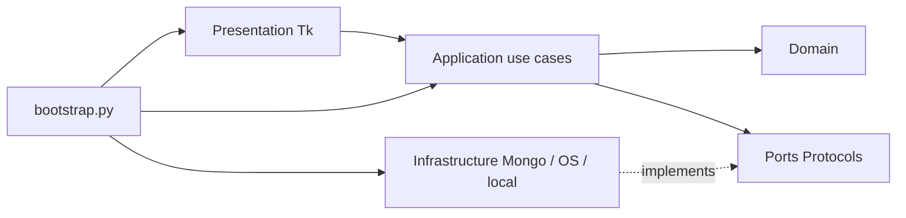

# NOTEAPP ENGINEERING BASE RULES v1.0 — TEAM 5

**Trạng thái:** DRAFT / proposed governance. **Nhánh tham chiếu:** `develop` ở commit `339ca282` (09/10/2026).  
**Áp dụng:** developer, QA, PM, reviewer, coding agents. `AGENTS.md` ở root là bản chỉ thị rút gọn để AI agent tự đọc; tài liệu này là *engineering contract* đầy đủ cho con người.

## 1. Thực trạng đã xác minh trên GitHub

| Phần | Trạng thái khi khảo sát | Hướng Phase 1 |
|---|---|---|
| `src/noteapp/domain` | Các entity/policy là docstring scaffold | Triển khai logic core thuần Python |
| `src/noteapp/application` | DTO, ports, commands, queries đều scaffold | Xây contract và use cases CRUD |
| `src/noteapp/infrastructure/mongo` | `client.py`, `indexes.py`, `repositories.py` scaffold | DB config, data mapping, Mongo repositories |
| `src/noteapp/presentation/tk` | UI views, state, presenters, async bridge scaffold | Shell 3-pane + create/list/edit async |
| `bootstrap.py`, `main.py` | chỉ docstring scaffold | Composition Root + runnable entry point |
| `tests/*` | `.gitkeep`, chưa có test thật | Unit, contract, integration, UI smoke |
| `pyproject.toml` | Python >=3.10, setuptools src-layout; không có runtime/dev dependency | version/extra/tooling/entry point |
| `.github/workflows/ci.yml` | `workflow_dispatch` + `echo` placeholder | PR/push CI thực thi checks |
| `.github/workflows/release.yml` | placeholder | Giữ nguyên, không phát hành ở Phase 1 |
| `docs/NoteApp_Team5_Blueprint` | hồ sơ SRS v2, kiến trúc, backlog sẵn có | Quy chiếu và cập nhật DEC/ADR |

**Kết luận:** repo có topology tốt nhưng chưa có implementation hoặc bằng chứng chạy ứng dụng; không đánh dấu feature là Done chỉ vì file đã tồn tại.

## 2. Scope governance và thứ bậc nguồn

- SRS gốc: FR-01..11 là Shall, FR-12..14 Should, FR-15..16 May. V2 thêm đề xuất FR-17 draft recovery, soft delete promote P0, yêu cầu reliability/security và schema version.
- Phase 1 là **W1–W2 trong kế hoạch 9 tuần**, chỉ xây foundation và CRUD vertical slice; **không** hoàn thành cả FR-01..11 ở Phase 1.
- `DEC-01..DEC-14` trong `01_SRS_AUDIT_AND_DECISIONS.md` vẫn `OPEN` tại hồ sơ tham chiếu. M1 ghi decision/approver/date; không tự coi các thay đổi đề xuất là baseline.
- Nếu DEC chưa ký: chỉ làm kỹ thuật **reversible**/fake tests dựa trên assumption ghi rõ, không làm thay đổi dữ liệu không dễ đảo ngược. Hạng mục có DEC blocking phải chờ sign-off trước khi merge production behavior.
- Mỗi issue có `requirement_ids`, `assumption_ids`, `acceptance_criteria`, `owner`, `reviewer`, `estimate_hours`, `dependency`, `evidence`.

## 3. Bảo vệ boundary kiến trúc



**Không được** ép application import từ infrastructure chỉ vì shortcut. Implement với dependency injection trong `bootstrap.py`.

| Biên | Thiết kế đúng | Phản ví dụ cần reject |
|---|---|---|
| UI ↔ app | presenter gọi `CreateNote.execute(NoteInput)` | UI import `pymongo.MongoClient` rồi `insert_one` |
| app ↔ domain | use case gọi policy `validate_title` | entity import `messagebox.showwarning` |
| app ↔ persistence | `NoteRepository` Protocol | use case biết collection name `notes` và dùng `$set` |
| infra ↔ Mongo | mapper ObjectId↔opaque ID, typed filter whitelist | UI chuyển thẳng `dict` chứa `$where` |
| threading | worker -> `queue.Queue` -> main pump | worker gọi `root.after`, `.config()` |
| startup | composition root khởi tạo use cases, `main.py` giữ lifecycle | `__init__.py` kết nối DB lúc import |

**Contract design**: một action (`CreateNote`, `UpdateNote`, `ListNotes`) có typed input/output; domain errors (`ValidationError`, `NotFound`, `Conflict`, `RepositoryUnavailable`) mapped thành view state thông qua presenter; DB exceptions không leak ra UI.

**Minimum interface ổn định cuối W1 (ví dụ, tên chi tiết được ADR phê duyệt):**

```python
@dataclass(frozen=True)
class CreateNoteInput:
    title: str
    content: str
    priority: Priority = Priority.MEDIUM
    category_id: str | None = None
    client_operation_id: str = ""  # khi gọi thật: UUID do presentation/application tạo

class NoteRepository(Protocol):
    def create(self, note: Note, operation_id: str) -> Note: ...
    def get_by_id(self, note_id: str) -> Note | None: ...
    def list_recent(self, limit: int, cursor: str | None = None) -> NotePage: ...
    def update_if_version(self, note: Note, expected_version: int) -> bool: ...
```

Ví dụ là *contract đề xuất*, team chốt DTO/return style trong ADR, không giữ default ID rỗng trong code production.

## 4. Data contract Phase 1

Đề xuất tối thiểu: `notes` gồm `_id`, `client_operation_id`, `title`, `content_plain`, `priority`, `priority_rank`, `category_id`, `is_deleted`, `version`, `created_at`, `updated_at`, `schema_version`; `categories` gồm `_id`, `name`, `name_key`, `color_hex`, `created_at`. Các field của reminder/attachment/crypto để Phase 2+, nhưng thiết kế mapper/schema đủ khả năng mở rộng.

- Unique `client_operation_id` khi create; create retry phải trả cùng note hoặc cùng trạng thái xác định, không nhân đôi.
- Update CAS: filter `_id` và `version`; `$inc: {version: 1}`; zero matched phải phân biệt `NOT_FOUND` và `CONFLICT`.
- Không delete cứng trong Phase 1; trạng thái delete lưu false mặc định. Hard purge/GridFS nằm milestone sau.
- DB indexes tối thiểu ở Phase 1: unique categories.name_key; unique sparse/partial notes.client_operation_id; index list active notes `(is_deleted, updated_at)`; nếu chưa chạy search thì **không** cần dựng text index vội.
- Migration phải idempotent, versioned, có dry-run/backup trước thay đổi nguy hiểm; `scripts/create_indexes.py` chạy lặp không phá dữ liệu.
- Tests integration dùng DB tên ngẫu nhiên/riêng, có teardown; không bao giờ drop DB ngoài danh sách test allowlist.
- Local `.env.example` không chứa secrets và `.gitignore` ignore `.env`, `.venv`, cache, build, local databases. Nếu không có MongoDB, unit tests vẫn chạy.

## 5. Thread model và UX event contracts

1. Tk main thread tạo widgets và poll `queue.Queue` qua `root.after(50..100)`; **chỉ main thread** gọi Tk API.
2. `ThreadPoolExecutor(max_workers≈4)` xử lý Mongo; worker trả `OperationResult` hoặc error envelope, không gửi widget reference sang thread.
3. Presenter giữ `request_seq`, `editor_revision`/`note_id`; không apply stale `ListNotes` hay `SaveNote` result vào editor khác.
4. Lưu có progression `DIRTY→SAVING→SAVED` khi DB xác nhận; `SAVING→ERROR` khi DB fail; text phải giữ. Ngắt DB không crash; chưa hỗ trợ encrypted local draft thì nói rõ `UNSAVED`.
5. Đóng cửa sổ khi còn pending future: hiển thị warning khi cần, chặn callback vào destroyed widget, cleanup executor và Mongo client theo lifecycle.
6. UI Layout khởi đầu 3-pane sidebar/list/editor theo SRS, dùng ttkbootstrap; không yêu cầu pixel-perfect ở Foundation.

## 6. Quality bar và kiểm soát tài nguyên

- **Unit:** domain validation, Priority rank, Note version/clock, idempotency use-case với FakeRepo, lỗi conflict/error mapping. Độc lập DB/GUI.
- **Contract:** kiểm tra ports / DTO và architecture import policy; không để UI biết `ObjectId`.
- **Integration:** Mongo CRUD, seed category unique, index verification, duplicate operation ID, optimistic conflict, DB disconnect (nếu testbed hỗ trợ), query limit/cursor.
- **UI smoke:** app bootstrap mở shell, save async/click behavior; Windows manual khi runner Linux không có màn hình; headless CI không gọi Tk root trong import.
- **Static:** Ruff check + format, compileall, pytest. Tool mới phải pin version range trong pyproject/lock; không tự đặt coverage 90% toàn repo khi toàn bộ còn stub. Phase 1 khuyến nghị >=80% trên **core logic mới**, đo có report (mức đề xuất).
- **Perf:** không cam kết NFR startup/search ở Phase 1 khi chưa có benchmark 5k/10k; ghi baseline đo sau với điều kiện máy.
- **Security:** không log note content, URI, credentials, key; không tích hợp secret vào package/ảnh chụp; không sử dụng Mongo admin account cho app runtime.

## 7. Repo workflow và review matrix

| Người | Ownership | Reviewer chéo mặc định |
|---|---|---|
| M1 — PM/Architect | backlog, DEC, ADR, architectural checks, contract approval | M3 hoặc M5 |
| M2 — Desktop UI | presentation, UX states, async bridge | M1/M5 |
| M3 — Core | domain, use cases, DTO/ports | M1/M4 |
| M4 — Data/Infra | Mongo client/repositories/indexes + dev DB | M3/M5 |
| M5 — QA/CI | pytest fixtures, CI, quality gates, RTM, reproducibility | M1/M3 |

- Review không kiêm duyệt phần tự viết; code owner phải tự test trước khi xin review.
- Nhánh theo task, PR vào `develop`, merge bằng squash nếu team chọn; `main` chỉ release. Mỗi PR mô tả test command + output thực sự; reviewer không chấp nhận `CI pass` nếu CI chỉ echo.
- Schema/ports migration là **breaking change** cần owner downstream approve; thêm ADR mới có status `Proposed` → `Accepted` trước merge.
- Khi 2 người sửa một file contract: lock API bằng ADR trước, chia PR có dependency, tránh chồng branch.

## 8. Definition of Ready / Done / Release Gate

**Ready**: issue có task ID, FR/NFR/CST, AC, dependency hoàn tất, input/output dự kiến, test positive/negative, owner, reviewer, ước lượng, quyết định liên quan đã chốt hoặc có assumption rõ.

**Done**: implementation chạy thật, type-safe, tests xanh, docs/ADR cập nhật khi cần, rollback rõ, review được approve, không bug P0/P1 mới, CI thật; `docs` có thể Done khi được duyệt và liên kết owner.

**Exit Phase 1**: cài môi trường từ README; CI push/PR chạy Ruff+unit+architecture/integration; app mở được trên Windows, tạo/sửa/list ghi chú với Mongo thật, restart vẫn có data; invalid title không mất draft trên UI; optimistic conflict không overwrite; 2 reviewer độc lập xác nhận; chưa code FR08/09/10/14/15/16.

## 9. Quyết định còn mở và liên kết sang Phase tiếp theo

Quyết định chặn trong Phase 1: DEC-01 scope, DEC-04 cách kết nối Mongo, DEC-08 giới hạn nội dung/schema, DEC-09 định nghĩa hiệu năng nếu dùng như gate. DEC-02/03/05/06/07/10/11/12/13 cần được theo dõi nhưng **không** nên kéo chức năng liên quan vào W1/W2 trước thời hạn.

Sau Phase 1 mới đến search/filter/trash → attachment → reminder + encrypted recovery → hardening → UAT theo `04_EXECUTION_PLAN_TEAM5.md` (thứ tự cập nhật bằng CR/ADR nếu bị đổi).

## 10. Template PR (copy vào phần mô tả)

```markdown
## Scope
- Task: P1-XX | FR/NFR/CST: ... | DEC/ADR: ...
- Đổi gì / không đổi gì:

## Implementation & safety
- Boundary được tuân thủ:
- Schema/index/backward compatibility:
- Rollback:

## Validation (output THỰC TẾ)
- [ ] ruff check / format
- [ ] unit / contract / architecture
- [ ] integration (nếu cần Mongo)
- [ ] UI screenshot/demo (nếu tác động UI)
- [ ] không secrets/log content

## Reviewer / risks
- Reviewer:
- Blockers, assumptions, known limitations:
```
