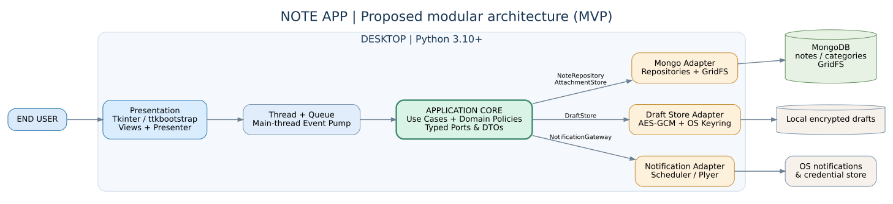
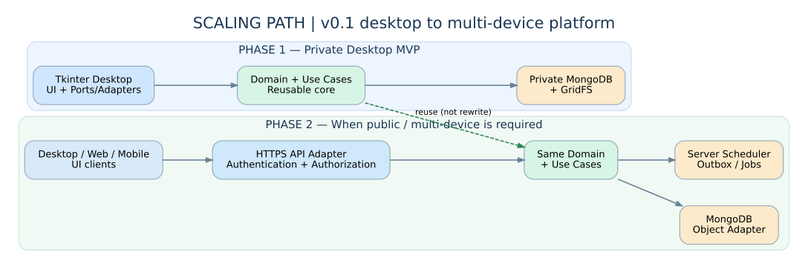
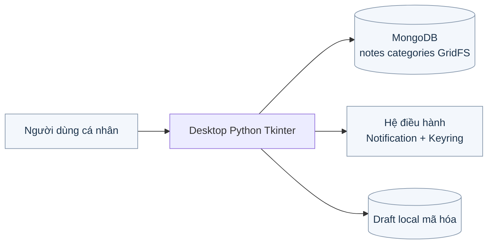
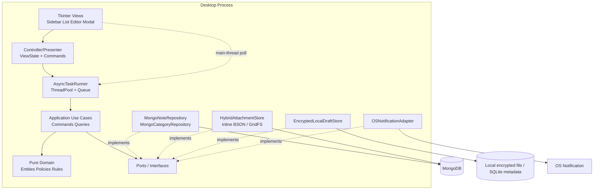
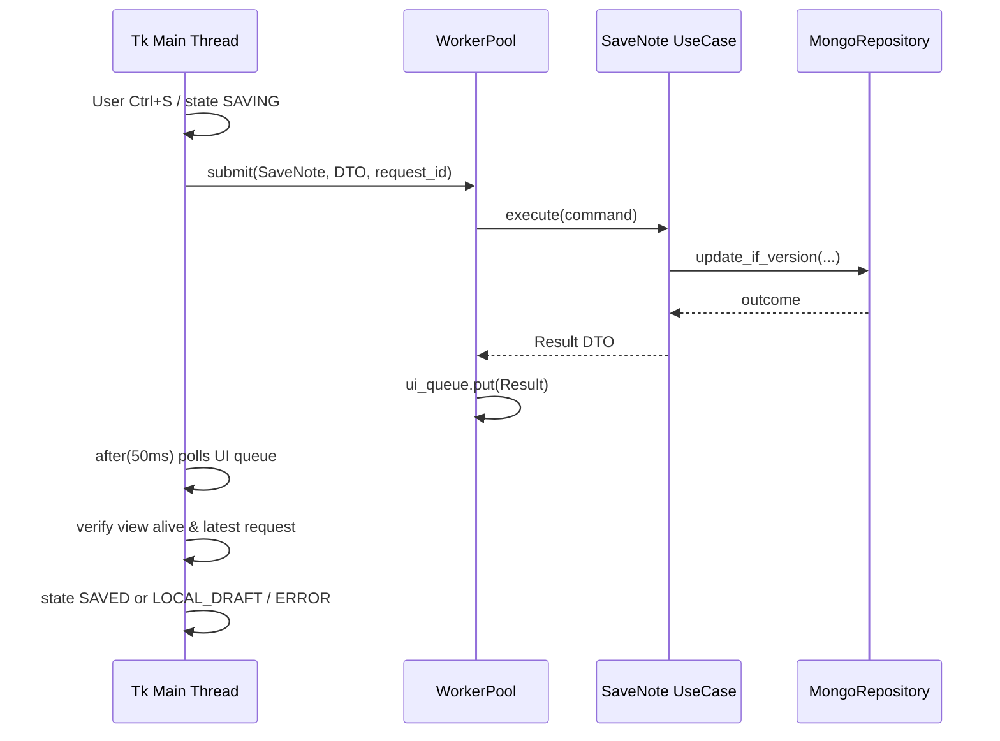
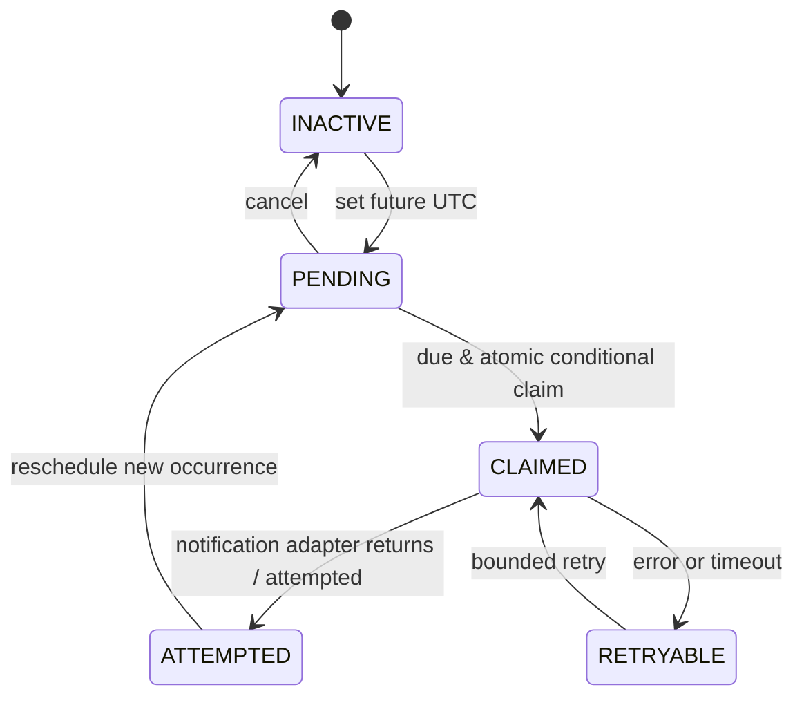
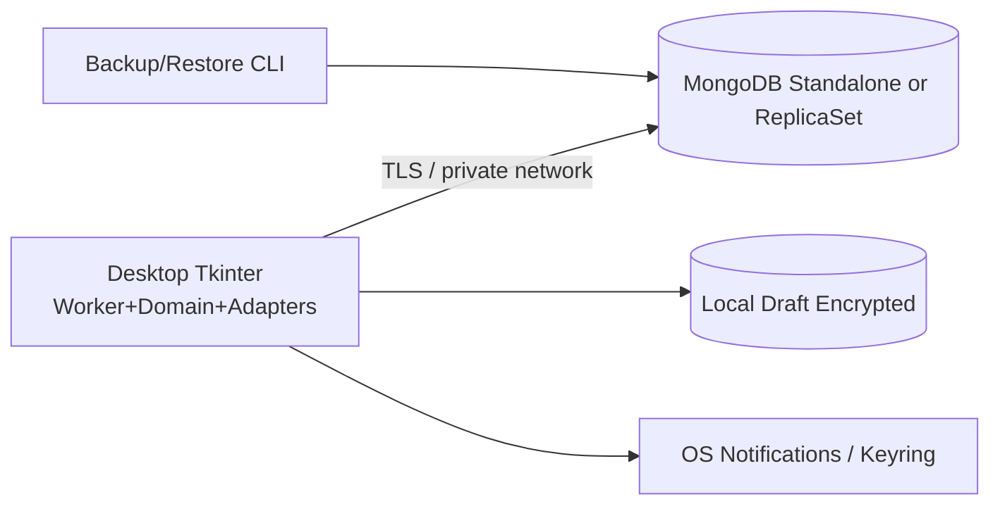
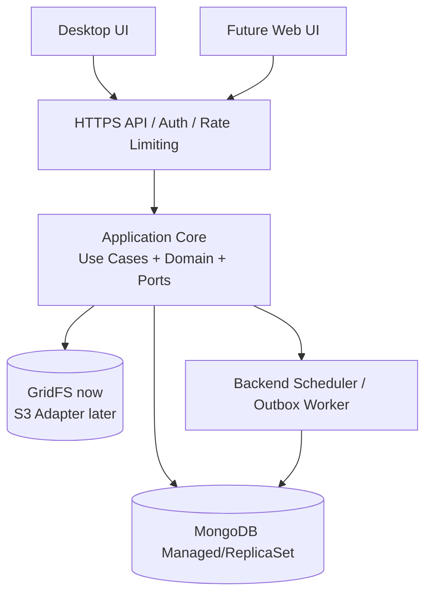

# 03 — SYSTEM ARCHITECTURE: NOTE APP DESKTOP → SCALE-READY

**Status:** Architectural proposal (không phải code đã triển khai). **Architectural style:** modular monolith theo Hexagonal/Ports & Adapters, Onion dependency direction. **MVP storage of record:** MongoDB. **UI:** Tkinter/ttkbootstrap. **No distributed services in MVP.**

**Sơ đồ tổng quan (mở trực tiếp hoặc hiển thị trên GitHub):**



**Sơ đồ nâng cấp kiến trúc:**



## 1. Nguyên lý thiết kế

1. **Business logic độc lập UI/DB:** không import Tkinter/PyMongo trong `domain/` và `application/`.
2. **Mỗi use case có một entry point:** `CreateNote`, `SaveNote`, `SearchNotes`, `SetReminder`, `TrashNote`, `RestoreNote`, `PurgeNote`, `RecoverDraft`.
3. **Ports define contracts:** `NoteRepository`, `CategoryRepository`, `AttachmentStore`, `DraftStore`, `NotificationGateway`, `Clock`, `UnitOfWork`.
4. **Composition Root tạo object:** UI không `MongoClient()`/`GridFS()` tự phát; wiring ở `bootstrap.py`.
5. **Thread safety từ hợp đồng:** background chỉ thực thi callable và gửi event, không gọi Tk methods. Tk root main thread gọi `root.after` poll queue.
6. **Vận hành có thể quan sát:** structured logs với correlation ID + stage duration, không ghi content/secret.
7. **Cấu trúc có thể chuyển sang API mà không refactor domain:** re-use core application, bổ sung HTTP adapter và authorization layer khi thực sự cần.

## 2. Sơ đồ logic cấp hệ thống (Context)



**Trust boundary:** Desktop app là untrusted nếu phân phối rộng; URI/DB credentials chỉ phù hợp máy được quản trị trong LAN/private môi trường học tập. **Không coi direct MongoDB từ desktop là giải pháp public SaaS an toàn.**

## 3. Container/component diagram (MVP)



**Biên `domain`** = mô hình Note, Category, Reminder, statuses, policy; **`application`** = orchestrate use cases+transaction; **adapters** = implementation. Các module `app` không truy cập raw Mongo. Nếu thay UI, adapters inbound thay Tkinter; nếu thay DB, outbound port implementation thay.

## 4. Source code layout khuyến nghị

```text
note_app/
├── pyproject.toml
├── src/noteapp/
│   ├── domain/
│   │   ├── entities/{note,category,reminder}.py
│   │   ├── value_objects/{priority,time_range,attachment_ref}.py
│   │   ├── policies/{note_validation,delete_policy}.py
│   │   └── errors.py
│   ├── application/
│   │   ├── commands/{create,update,trash,restore,purge,set_reminder}.py
│   │   ├── queries/{search_notes,list_notes,get_note}.py
│   │   ├── services/{attachment_service,reminder_service,draft_recovery}.py
│   │   ├── ports/{note_repository,category_repository,attachment_store,
│   │   │          draft_store,notification_gateway,clock,unit_of_work}.py
│   │   └── dto/{note_input,note_view,note_filter,operation_result}.py
│   ├── infrastructure/
│   │   ├── mongo/{client,repositories,models,indexes,migrations}.py
│   │   ├── attachment/{hybrid_store,image_validator,thumbnailer}.py
│   │   ├── local/{encrypted_draft_store,keystore}.py
│   │   ├── notifications/plyer_gateway.py
│   │   ├── scheduler/{reminder_poller,purge_worker}.py
│   │   ├── telemetry/{logging,metrics}.py
│   │   └── config.py
│   ├── presentation/tk/
│   │   ├── views/{app_window,sidebar,note_list,note_editor,dialogs}.py
│   │   ├── presenters/{notes_presenter,editor_presenter}.py
│   │   ├── state/{editor_state,list_state}.py
│   │   └── async_bridge/{task_runner,ui_event_pump}.py
│   ├── bootstrap.py
│   └── main.py
├── tests/{unit,integration,ui,contract,performance}/
├── scripts/{seed_notes,create_indexes,backup_restore_check}.py
├── docs/{adr,srs,architecture,testing}/
└── .github/workflows/{ci,release}.yml
```

**Architecture gate** (pytest/import-linter or AST): `domain` không import `application,infrastructure,presentation`; `application` không import `infrastructure,presentation,tkinter,pymongo,gridfs,plyer`; `presentation` chỉ import public use cases/DTOs, không import repository internals; `infrastructure` implement ports; `bootstrap` duy nhất composition root.

## 5. Ports contract sơ bộ

```python
from dataclasses import dataclass
from datetime import datetime
from typing import Protocol

@dataclass(frozen=True)
class NoteFilter:
    text: str | None = None
    category_id: str | None = None
    start_utc: datetime | None = None
    end_exclusive_utc: datetime | None = None
    sort: str = "updated_desc"  # whitelist enum in production
    limit: int = 30
    cursor: str | None = None

class NoteRepository(Protocol):
    def create(self, command: "NoteToCreate", operation_id: str) -> "Note": ...
    def update_if_version(self, note: "Note", expected_version: int) -> bool: ...
    def find(self, note_id: str) -> "Note | None": ...
    def search(self, criteria: NoteFilter) -> "SearchPage": ...
    def soft_delete(self, note_id: str) -> None: ...

class DraftStore(Protocol):
    def save_encrypted(self, draft: "Draft") -> None: ...
    def load_recoverable(self) -> "list[Draft]": ...

class NotificationGateway(Protocol):
    def attempt(self, event: "ReminderEvent") -> "NotificationResult": ...
```

- `NoteFilter` là typed safe DTO; layer repository tự compile Mongo operators.
- Use cases chỉ return DTO/result (not Tk widgets, not BSON-specific ObjectId).
- Hợp đồng update version: `find_one_and_update({_id, version:n}, {$set:..., $inc:{version:1}})`; modified=0 → conflict/not found phân biệt.
- Có test fake adapters để chạy unit hoàn toàn offline.

## 6. Data architecture & persistence

### 6.1 Collections & metadata

```json
{
  "notes": {
    "_id": "ObjectId",
    "client_operation_id": "uuid-v4 unique per create",
    "title": "string, 1..250",
    "content_plain": "string | null; null when locked",
    "content_encrypted": "{alg, kdf, salt, nonce, ciphertext, version} | null",
    "category_id": "ObjectId | null",
    "priority": "HIGH|MEDIUM|LOW",
    "priority_rank": "3|2|1",
    "is_pinned": "bool",
    "attachment": "{storage_mode, gridfs_id?, inline_bytes?, mime, size, sha256} | null",
    "reminder": "{time_utc, active, status, occurrence_id, attempted_at, retry_count}",
    "is_deleted": "bool",
    "deleted_at": "datetime | null",
    "version": "int",
    "schema_version": "2",
    "created_at": "UTC datetime",
    "updated_at": "UTC datetime"
  },
  "categories": {"_id":"ObjectId", "name":"string", "name_key":"casefold/trim unique", "color_hex":"#RRGGBB", "created_at":"UTC"}
}
```

**Đây là schema v2 đề xuất, KHÔNG phải shape đã có trong SRS gốc.** Nếu hiện thực trên DB theo schema gốc phải có migration `v1 → v2` (rename content, priority_rank, version, attachment fields) và migration rollback/backup. `category_name` cũ chỉ làm snapshot/compatibility, canonical qua `category_id`.

### 6.2 Index strategy đề xuất

```javascript
// MongoDB shell — ví dụ, điều chỉnh dựa explain()/dataset trước production
notes.createIndex({client_operation_id:1},{unique:true, sparse:true})
notes.createIndex({title:"text",content_plain:"text"},{name:"idx_text"})
notes.createIndex({is_deleted:1,is_pinned:-1,priority_rank:-1,updated_at:-1})
notes.createIndex({is_deleted:1,category_id:1,updated_at:-1})
notes.createIndex({"reminder.active":1,"reminder.status":1,"reminder.time_utc":1})
notes.createIndex({is_deleted:1,deleted_at:1})
categories.createIndex({name_key:1},{unique:true})
// NO TTL idx_notes_deleted_at: cleanup must delete GridFS as well
```

Đối với document đã mã hóa, không index nội dung plaintext; tiêu chí tìm kiếm locked note cần chốt chính sách. Tìm tiếng Việt phải benchmark có/không dấu theo semantics đã duyệt; `$text` không đồng nghĩa với semantic search hay substring. Bổ sung filter + sort index nếu `explain()` cho thấy in-memory sort nhiều.

### 6.3 Attachment consistency

1. Validate before upload (size, extension **và** magic bytes, pixel bound).
2. Với <=1MiB, gắn `bson.Binary` cùng note write; nếu vượt BSON tổng cộng → từ chối/route GridFS nếu quyết định cho phép.
3. Với GridFS, upload trước vào trạng thái temporary với owner operation ID; tạo/update note có tham chiếu chỉ sau khi upload hoàn tất.
4. Nếu note write fail, delete temporary GridFS id trong compensation/reconciliation; nếu process crash, startup/maintenance quét orphan theo `created_at + safety window`.
5. Khi replace image: save new→atomic swap ref→purge old after successful swap; không xóa old trước.
6. Khi permanent delete/trash purge: ghi trạng thái `PURGING`, xóa blob có idempotent retry, xóa note; nếu crash thì next pass tiếp tục.

**Transaction** Mongo multi-document chỉ khi deployment hỗ trợ replica set và session transactions; MVP không được phụ thuộc ngầm vào transaction trên standalone Mongo. Compensation là bắt buộc ngay cả với transaction để xử lý GridFS/các external effects.

### 6.4 Purge policy

**Không dùng TTL trên `deleted_at` của notes**. Worker (app open hoặc maintenance CLI định kỳ) tìm note trong trash quá 30 ngày, claim state, xóa attachment, xóa note, log. Nếu app không mở nhiều ngày, purge sẽ trễ; nếu yêu cầu tự purge trên server bất kể app mở, chuyển worker sang backend scheduled job khi scale. Phải có backup/restore policy để tránh xóa nhầm.

## 7. Threading & UI runtime



**Bắt buộc:** `root.after()` **chỉ đăng ký trong main thread**; worker gửi queue. `ThreadPoolExecutor(max_workers=4)` mặc định, config; avoid one thread/request. `UIEventPump` hủy scheduled callbacks on close, future cancellation best-effort, no Tk update after destroy. Stale search results sử dụng `request_seq`; only latest accepted.

**UI state machine:** `CLEAN → DIRTY → SAVING → SAVED`, error `SAVING → LOCAL_DRAFT/ERROR`, conflict `SAVING → CONFLICT`, `LOCAL_DRAFT → SYNCING → SAVED`. Spinner không có nghĩa server persisted.

## 8. Reminder design & semantics



- Scheduler poll ~30s **while app is running**, and scan at startup for missed events. Database query time `<=now` not client-only filter.
- Atomic claim via `find_one_and_update(status:PENDING, occurrence_id, due<=now, status=CLAIMED, claimed_at=now)`; in single desktop profile enough, future multi-device requires lease expiry and dedup key.
- `plyer` acceptance ≠ OS displayed. State `ATTEMPTED` means attempted call; at-most-once *attempt* is preferable in simple MVP, but crash may duplicate/lose attempts; document best effort, not exactly-once.
- Locked note notification: generic title/message; no content plaintext.
- App closed: no notification in MVP, explicitly user-facing setting/help.
- Timezone: local edit → timezone-aware UTC, ambiguous DST reject or require clarification; now/from clock port testable.

## 9. Encrypted local drafts & recovery (proposed)

- Local recovery MUST avoid unencrypted JSON and unencrypted temp files. Suggested: persist encrypted serialized draft bytes (AES-GCM) in user app data, with key in platform credential store/keyring; add integrity/version/header. If keyring unsupported, disable auto-local-persist and prominently warn, preserve unsaved text in RAM until close.
- Snapshot every ~3-5 seconds debounce or on focus change; `fsync`/atomic replace temp file; lock file / one app profile instance; bounded autosave size and retention; TTL cleanup for drafts (not notes).
- `draft.base_version`, `draft.local_updated_at`, `draft.note_id`, `draft.operation_id`; on reconnect: prompt restore→conditional save or create duplicate on conflict; never silently choose local/remote.
- If a note was locked, local draft encryption is separate from note encryption; don't persist unlocked plaintext outside encrypted payload.
- Cross-device offline editing/sync NOT MVP; for future adopt server-generated revisions and conflict UX (manual resolve, never blind last-write-wins).

## 10. Security boundaries

| Threat | Control MVP | Future public deployment |
|---|---|---|
| Desktop DB credentials stolen | LAN/private, least-privileged Mongo role, TLS when remote, secret injection, no shipped admin URI | Desktop talks HTTPS API with user authentication/authorization, no DB URI |
| NoSQL injection | typed DTO→compiled whitelist query, no raw dict from UI | Input schema validation/API limits |
| Weak short PIN guessing | `[DEC-10]` passphrase + PBKDF2HMAC configured work factor, per-note salt, AES-256-GCM, nonce uniqueness | Argon2id/hardware bound keys, advanced KMS |
| Path traversal/image bombs | file dialog path validation; never trust stored filename for export; pixel/size bound | server-side scan/quotas/object storage |
| Secret in logs | redaction, minimal logs, crash dump policy | central log pipeline with scrubber |
| Reminder privacy | redact locked notes, OS notification permission handling | cross-device preference & ACL |
| Offline data theft | encrypted drafts, keyring, single-profile protection | encrypted sync store/device keys |

## 11. Deployment topology

### MVP — self-contained desktop + private MongoDB



Mongo can run local Docker for development. For a client distributed to unknown users, remote direct Mongo is **not acceptable**; do not publish open MongoDB port.

### Phase 2 — scale to multi-device/web without changing domain use cases



**Migration steps:**
1. Isolate pure `domain`+`application` into distributable internal Python package (single repo initially).
2. Add HTTP adapter exposing `NoteAPI v1`; desktop switches outbound from Mongo adapter to API repository adapter (feature flag/migration rollout).
3. Add identity/authz to API, per-user ID/tenant partition and indices; key migration plan for encrypted notes (server must not know passphrase if E2E design).
4. Move reminder/purge to server worker if product requires closed-app delivery; use durable queue/outbox before horizontal scale.
5. Replace GridFS with S3-compatible object store only if cost/throughput/availability justify; preserve `AttachmentStore` port contract.

**Scale signals:** >100k notes/user or multi-user access, upload throughput bottleneck, high DB latency, need sync/API, backend scheduled notifications. Measure first; do not adopt microservices in response to hypothetical traffic.

## 12. CI/CD & observability

- Unit tests pure domain/application with fake ports; integration with Mongo testcontainer/docker service, GridFS and indexes; UI smoke scripted limited to supported runners.
- Static checks: Ruff, Mypy (target changed modules), `pytest`, dependency/import gate, secrets scan (`detect-secrets` or equivalent), dependency vulnerability audit.
- CI matrix Python 3.10 and supported Python current version, Windows+Ubuntu; macOS separate smoke when runner/host supports GUI.
- Metrics local: `note_save_latency_ms`, `mongo_query_latency_ms`, `reminder_attempt_count`, `draft_recovery_count`, `gridfs_orphans_cleaned`, UI queue length; no PII.
- Logging: operation id, step, duration, error class (not body, URI, key, passphrase).

## 13. Architecture Decision Records (ADR)

| ADR | Decision | Status | Trade-off |
|---|---|---|---|
| ADR-001 | Modular Monolith + Ports & Adapters | Proposed | Thêm interface/discipline để đổi UI/DB dễ |
| ADR-002 | MongoDB là source-of-truth MVP | Constrained by SRS | Remote desktop credential risk; private environment only |
| ADR-003 | Hybrid BSON/GridFS theo 1MiB | Constrained by SRS | Thêm reconciliation logic |
| ADR-004 | Main-thread UI + worker queue event pump | Proposed | UI async event/state code nhiều hơn |
| ADR-005 | Không TTL notes; purge worker | Proposed | Dọn được GridFS nhưng purge có thể trễ khi app tắt |
| ADR-006 | Encrypted local draft (not full sync) | Proposed | Khôi phục an toàn nhưng phải quản lý khóa OS |
| ADR-007 | API backend chỉ xuất hiện khi multi-device/public | Proposed | Giữ MVP gọn; phải migration access path sau |
| ADR-008 | Atomic version + idempotent operation id | Proposed | Cần schema fields/index bổ sung |

**Migration invariant:** từ v1 lên v2 không mất note/blob, có backup trước, migration thử trên seed dữ liệu và restore rollback.
