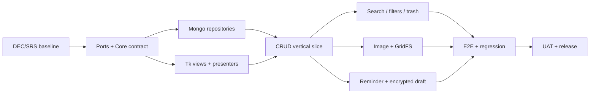

# 04 — DELIVERY PLAN CHO TEAM 5 (PROJECT MANAGER + SYSTEM DESIGN)

**Trạng thái:** đề xuất; lịch là giả định, không phải cam kết đã giao đội.  
**Giả định:** 5 thành viên x **16 giờ/tuần** x **9 tuần** = 720 giờ tổng khả dụng; phân bổ ~79% planned tasks, còn ~21% cho buffer họp/bug/thiếu kỹ năng. Cần rà soát năng lực/thời gian thật lúc kickoff.  
**Sprint cadence:** 1 tuần, demo cuối tuần. **Phương pháp:** incremental/vertical slice, tránh chia UI/DB độc lập quá lâu.

## 1. Cơ cấu phân vai

| Slot | Vai trò | Ownership chính | Review chéo |
|---|---|---|---|
| **M1** | PM / BA / Solution Architect (Team Lead) | Scope/DEC/SRS, interfaces, architectural gates, sprint/release, decision log | Phê duyệt contract/core changes; review NFR |
| **M2** | Desktop UI Engineer | UI 3 pane, presenters, responsive Tk, state/shortcuts, UI tests | Review accessibility/UX & async bridge |
| **M3** | Core / Application Engineer | Domain model, use cases, validation, typed DTO, conflict/error flows | Review test coverage and API boundary |
| **M4** | Data / Infrastructure Engineer | Mongo repositories/index, GridFS, local draft crypto integration, scheduler, packaging | Review data safety/security & migration |
| **M5** | QA / Automation / Release Engineer | Test strategy, fixtures, integration E2E, CI, benchmark, release checklist | Test review tất cả FR, hỗ trợ triage |

> Mỗi FR tối thiểu 1 **code owner** + 1 **reviewer** khác người; QA không gánh toàn bộ chất lượng, dev viết unit/integration test cho code của mình. PM không chỉ viết tài liệu mà phụ trách architecture gate và integration review.

## 2. Release structure

- **MVP Release Candidate (0.1-RC) — cuối tuần 7 nếu gates đạt:** FR-01..11, soft-delete/trash (FR-13 theo DEC-01), encrypted draft recovery, documentation/CI. Reminder v1 chỉ chạy khi app mở.
- **MVP Release 0.1 stable — tuần 8–9:** hardening, backup restore drill, NFR benchmark & packaging, UAT. **FR-12 pin** chỉ kéo vào tuần 7 nếu buffer tốt.
- **R1 / 0.2:** FR-12+FR-14 (encrypt locked notes), có thể bắt đầu spike bảo mật trong dự án nhưng không hứa hoàn tất trong 9 tuần.
- **R2 / 0.3:** FR-15 export, FR-16 statistics, multi-image/API evolution.

**KPI release:** 100% Shall-in-scope có testcase PASS; 0 blocker P0, 0 major P1 không có mitigation được duyệt; demo vertical flow thành công; chưa đo target NFR thì ghi `NOT VERIFIED` (không claim PASS).

## 3. Timeline và công việc theo tuần

| Tuần | Mục tiêu tích hợp | Deliverable, test gate | Owner điều phối |
|---|---|---|---|
| **W1: Inception / Foundation** | DEC chốt, repo scaffold, contracts, DB dev | SRS baseline + ADR, import gate, initial CI, prototype 3-pane, seed | M1 |
| **W2: CRUD Vertical Slice** | Create/edit/list categories/priority persistence | create→list→edit demo thật Mongo; validation, category unique, NFR basic logs | M3+M4 |
| **W3: Search + Filtering + Deletion** | Mongo text search, sort, time filter, trash | search/filter/sort, soft-delete/restore/hard-delete stub, stale-response tests | M2+M3 |
| **W4: Images End-to-End** | Pillow validation, inline/GridFS, thumbnail, delete cleanup | ảnh boundaries 1/10MiB, interrupted upload cleanup, performance/no-freeze | M4 |
| **W5: Reminder + Recovery** | scheduler, notify, encrypted draft/cache, reconnect | app-open reminders, restart recovery, offline/timeout tests | M3+M4 |
| **W6: Regression + MVP Hardening** | fix P0/P1, cross-module regression, UI UX | integration E2E, CI all green, security review, backup scripts | M5 |
| **W7: Release Candidate** | RC smoke, cross-module fixes, integrity audit | release candidate evidence, UAT dry run | M1+M5 |
| **W8: Package & Restore** | build/installation, backup/restore drill, docs and platform smoke | package artifacts, restore report, handover docs | M4+M1 |
| **W9: UAT & Release** | NFR benchmark final, acceptance and formal release | signed test report, UAT sign-off, known limitations | M1+M5 |

### Chi tiết chuyển giao công việc từng tuần

**W1 — thiết kế không quá dài, phải có code skeleton:**
- M1: hỏi/chốt DEC-01..DEC-14, lập GitHub Project, ADR & interfaces public; đánh dấu OPEN còn lại.
- M2: wireframe 3 pane, UI state machine, event pump proof-of-concept (Tk main thread).
- M3: Note/Category entities, DTO, validation, use-case skeleton, fake ports & unit tests.
- M4: Mongo Docker/dev scripts, create indexes/migrations, test fixtures, GridFS spike.
- M5: test matrix initial, pytest GitHub Actions, lint/import gate, seed 10k, smoke plan.
- **Gate W1:** `pytest` pass, import gate pass, DB local seeded, no direct PyMongo in UI, baseline decisions traceable.

**W2 — vertical slice:**
- M2: editor create/edit/list; states dirty/saving/saved/error; keyboard shortcuts.
- M3: Create/Update/List/Category use cases, errors mapping, optimistic version, unit tests.
- M4: concrete MongoNoteRepository + MongoCategoryRepository, unique indexes, integration tests.
- M5: tests invalid title, duplicate categories, disconnected DB; baseline timings.
- M1: review schema/index+backlog; UI demo recorded.
- **Gate W2:** restart app vẫn đọc được note thật, tạo/sửa có lưu bền vững, error flow không crash.

**W3 — retrievability/safety:**
- M2: search bar debounce, stale result dropping, filters + trash UI.
- M3: SearchNotes, Sort, TrashNote/RestoreNote, version checks.
- M4: `$text` index, bounded pagination, priority_rank, DB time range inclusive UX/exclusive UTC query; purge spike.
- M5: accents/Vietnamese semantics, filter boundaries, sort order, multi-query race, trash regression.
- **Gate W3:** scenario combined search+category+date, restore works, UI async never blocks under forced DB delay.

**W4 — images:**
- M2: attachment preview, loading state, remove/replace controls.
- M3: `AttachmentService`, single-image rule, error domain mapping.
- M4: validation, small inline, big GridFS, cleanup/reconcile and thumbnail worker.
- M5: exact bytes at 1MiB/10MiB, wrong MIME, corrupt, 100x big dimension, interrupted writes.
- **Gate W4:** full note+image, delete/replace without orphan, memory profile recorded.

**W5 — reminder/offline recovery:**
- M2: reminder dialog/time UX, offline banner, restore draft prompt.
- M3: scheduler use-case/reminder status, app recovery state, clock fake tests.
- M4: background poll/claim, OS notification gateway, encrypted draft store+keyring, backoff.
- M5: time travel fake-clock tests, app restart/offline, keyring failure, notification permission deny.
- **Gate W5:** calendar→UTC→notify, no duplicate in session, draft survives crash without plaintext file.

**W6 — quality/security:**
- M1: audit DEC closure/release risks, threat model, SRS actual-completion mapping.
- M2/M3/M4: close integration bugs; graceful close; fallback UI; errors+logs.
- M5: repeated regression, performance scripts, packaging reproducibility, recovery drill.
- **Gate W6:** complete MVP E2E, 0 P0/P1 open, no plaintext leak, no orphan leak over scheduled cleanup.

**W7 — release candidate, không còn mở feature:**
- M1: UAT dry run, kiểm tra bằng chứng nghiệm thu.
- M2/M3: khắc phục UX / Core integration bugs, không thêm feature mới.
- M4: GridFS/purge integrity audit.
- M5: RC regression, triage và platform smoke.
- **Gate W7:** RC demo pass, no known P0/P1 open.

**W8 — packaging & backup/restore:**
- M1/M4: thao tác backup/restore trên staging, tài liệu bảo trì.
- M2/M3: user guide + architecture contract handover.
- M4: package Windows, smoke Ubuntu; macOS nếu có runner/thiết bị.
- **Gate W8:** release candidate packaged, restore drill passed.

**W9 — UAT & release chính thức:**
- M1: UAT session, sign-off, release notes và giới hạn đã biết.
- M5: benchmark cuối, final test report PASS/FAIL/BLOCKED, matrix hệ điều hành và checksums.
- **Gate W9:** phê duyệt nghiệm thu, không claim mục NFR/platform chưa đo.

## 4. Dependency network / critical path

**Critical path:** DEC/SRS → interfaces → CRUD end-to-end → images/reminder/recovery integrated → regression → UAT. Search/UI được phát triển song song khi core contract đã ổn định. Không chờ UI hoàn chỉnh mới test DB.

## 5. Capacity và cách dùng backlog CSV

- Tổng capacity lý thuyết 720 giờ = 5 người × 9 tuần × 16 giờ.
- **Target planned engineering <= 576 giờ**; tối thiểu **144 giờ buffer** (~20%) bao gồm review/meetings/bugs/unknowns.
- `06_IMPLEMENTATION_BACKLOG.csv` định nghĩa owner `M1..M5`, `estimate_hours`, sprint, dependency; PM kiểm tra tải từng người trước khoá sprint, chuyển/giảm task nếu >80% capacity.
- Estimates chỉ để dự báo, không được coi là fact. Spike/POCs có timebox; có thể giảm phạm vi R1/R2 không ảnh hưởng P0.

## 6. Workflow issue / branch / PR

- Main protected (`main`), integration branch `develop` (nếu team chọn GitFlow) hoặc trunk-based với short-lived feature branches; chỉ chọn **một** chiến lược từ W1.
- Branch: `feature/FR-06-search`, `fix/AUD-02-gridfs-purge`, `test/TC-...`, `docs/DEC-...`.
- Issue fields: business goal, FR/TC IDs, AC, design impact, estimate, owner, deps, test evidence.
- PR template: summary, linked issue/FR/TC, screenshots (UI), schema changes/migration, risk, local + CI test results, rollback.
- Review: >=1 peer reviewer; M1 review core dependency boundaries & schema; M5 review reproducibility/regression; merge khi required checks green.

## 7. Chất lượng và kiểm soát dự án

### Definition of Ready
- Input rõ + mock/contract + AC testable + decision log không block + estimate <1 tuần/issue + data migration identified.

### Definition of Done
- FR AC pass; unit/integration tests; lint/type gates; docs/API contract update; no secret in logs; no migration without backup; reviewer sign-off.

### Sprint ceremonies tiết kiệm thời gian
- Planning 45 phút mỗi tuần; async daily update 3 dòng (done/next/blocker); integration sync 15 phút 2 lần/tuần; review/demo 30 phút; retro 20 phút.

### RACI đơn giản
- M1 Accountable quyết định kỹ thuật/phạm vi (PO/giảng viên **Approve** requirement changes).
- M2 Responsible UI; M3 core; M4 data/ops; M5 QA/release; cross-review as above.

## 8. Risk register

| Risk | Impact | Trigger | Owner | Mitigation / contingency |
|---|---|---|---|---|
| R-01 MongoDB remote secrets | Security release blocker | URI embedded binary/public DB | M4/M1 | private network/TLS/least privilege; postpone public deployment until API |
| R-02 Tk event loop blocked | Perceived unusable UI | DB call on main, image load | M2 | worker queue, profiling/slow DB tests |
| R-03 Inconsistent GridFS files | Storage leak/data loss | interrupted save/delete | M4 | operation IDs, compensate/reconcile, cleanup test |
| R-04 Reminder missed/duplicate | Incorrect reminders | app closed/crash | M3 | best-effort semantics, atomic claim, explicit UX |
| R-05 Offline plaintext | Sensitive data leak | JSON drafts/tmp file | M4 | AES-GCM+OS keyring, fail-closed |
| R-06 Vietnamese `$text` mismatch | Search quality dissatisfaction | accent/phrase miss | M5 | early spike W1/W3, decide semantics |
| R-07 Cross-platform UI/notification | CST-05 fail | runner/device not present | M5 | early platform smoke W2; mark UNVERIFIED |
| R-08 R1 scope creep | Delay MVP | encryption/export added too soon | M1 | scope lock, W6 feature freeze |
| R-09 Team capacity lower than assumed | Milestone slip | <16h/person/week | M1 | recalc plan; only P0 first, reduce R1/R2 |

## 9. Phương án giảm scope khi trễ

**Không được cắt:** FR-01..11 đã xác nhận, các đường đi dữ liệu an toàn, tránh lộ thông tin, UI không treo, tests core, backups.  
**Cắt trước:** FR-16 stats, FR-15 export, FR-12 pin, polish/advanced icon, thêm tệp đính kèm, API/multi-device; FR-14 security feature nếu chưa bắt đầu thì R1 theo gốc Should, nhưng không để mã hóa dang dở thành code mặc định.

## 10. Bàn giao cuối dự án

Repo Git có tag release; README install/launch/troubleshooting; file SRS approved + DEC log; kiến trúc & sơ đồ; Mongo bootstrap indexes/schema/migration; `.env.example` (không có secrets); test report/RTM/benchmark; screenshots/demo; release binary cho platform đã test; known limitations; backup/restore steps.
