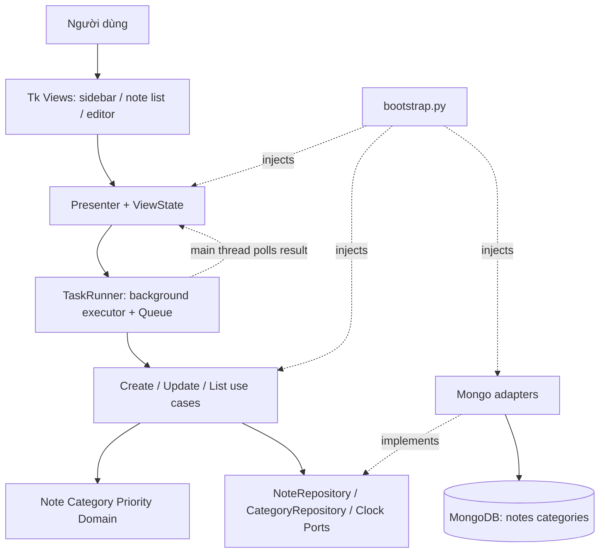
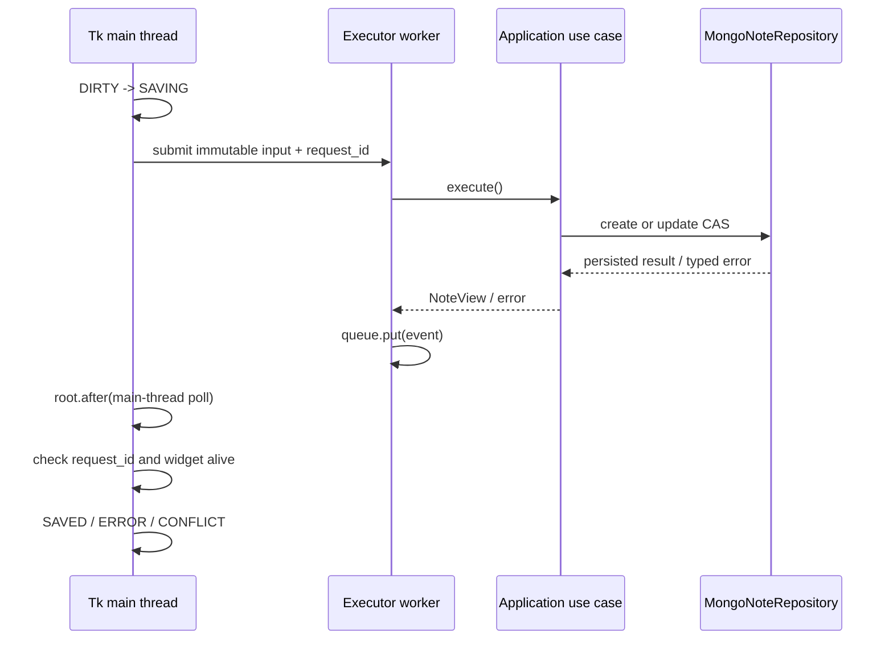
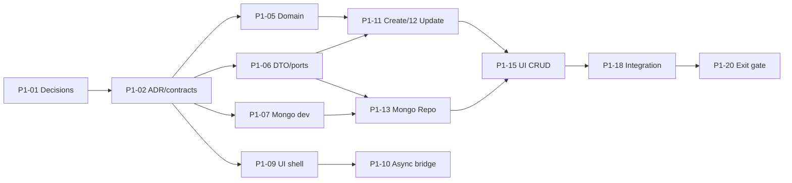

# PHASE 1 — FOUNDATION + CRUD VERTICAL SLICE (TEAM 5)

> **Tình trạng:** PROPOSED, để PM/PO review. Không tự coi SRS v2/DEC OPEN là APPROVED.  
> **Repo:** https://github.com/20261IT6131002/pythonNC_nhom2/tree/develop  
> **Baseline đã kiểm tra:** `develop` commit `339ca282a1a80a0698e8922a82187fa1fc9b9508`, ngày 09/10/2026.  
> **Khoảng triển khai:** hai tuần đầu (W1–W2) trong roadmap 9 tuần đã lập; 5 thành viên M1–M5, mỗi người **giả định** 16 giờ/tuần.

## 1. Outcome, phạm vi và không làm

**Outcome W1:** contracts/ADR đã review, setup môi trường Mongo dev, tooling + CI thực, domain/DTO/port dùng được với fake, Tk 3 pane + worker UI event pump demo không treo.  
**Outcome W2:** app `python -m noteapp.main` hoạt động; tạo → đọc danh sách → sửa ghi chú văn bản với Mongo thật, có category/priority cơ bản; tắt/mở vẫn còn dữ liệu; duplicate create và stale update được bảo vệ; GitHub Actions chạy tests.

| Yêu cầu SRS | Phase 1 cam kết | Không được claim Done |
|---|---|---|
| FR-01 | create note text, title 1..250, metadata UTC, category/priority | đính kèm ảnh trong create |
| FR-02 | update text/priority/category với version optimistic | full offline sync/recovery |
| FR-04, FR-05 | category seeded/lookup/unique, priority HIGH/MEDIUM/LOW | full category UI lifecycle/delete |
| CST-01,02,03 | Python >=3.10, Tkinter/ttkbootstrap, I/O worker + queue | xác minh full Windows/Ubuntu/macOS |
| Security/reliability | typed DTO, no secrets, keep unsaved editor state, integration safeguards | encrypted local drafts/full remote DB deployment |

**Không triển khai Phase 1:** FR-03 delete, FR-06 full-text search, FR-07 date filter, FR-08 images/GridFS, FR-09/10 reminder, FR-11 full sorting, FR-12/13/14 advanced security/trash, FR-15/16 export/stats, đề xuất FR-17 encrypted local recovery. Những yêu cầu vẫn ở roadmap sau, không tự hạ mức Shall/Should của SRS.

**Stack cố định:** Python, Tkinter/ttkbootstrap, MongoDB/PyMongo, modular monolith + Hexagonal. Không thêm FastAPI/Redis/microservices/event bus trong Phase 1.

## 2. Audit thực tế repo (không coi scaffold là code)

| Đường dẫn thực tế trên `develop` | Tình trạng | Việc cần làm |
|---|---|---|
| `pyproject.toml` | chỉ cấu hình setuptools, Python >=3.10, chưa dependencies/extras | runtime/dev dependencies, entrypoint, lint/test config |
| `.github/workflows/ci.yml` | `workflow_dispatch` + `echo` | thay CI có trigger PR/push, Ruff/pytest/contract/integration |
| `.github/workflows/release.yml` | placeholder | chưa đụng trong Phase 1 |
| `src/noteapp/domain/**` | class/entity/policies docstring skeleton | thuần Python validation, entity, value objects |
| `src/noteapp/application/**` | commands/ports/DTO/query docstring skeleton | Protocol, DTO và use cases thật |
| `src/noteapp/infrastructure/mongo/**` | client/indexes/repo/models docstring skeleton | connection, mapping, indexes, queries |
| `src/noteapp/presentation/tk/**` | views/presenters/states/async_bridge docstring skeleton | Tk shell + async save/list/edit |
| `src/noteapp/bootstrap.py`, `main.py` | docstring skeleton | composition root, app lifecycle |
| `tests/{unit,contract,integration,ui}` | `.gitkeep` | tests thật, fixtures, architecture gate |
| `docs/NoteApp_Team5_Blueprint/**` | có SRS v2 + architecture + plan + backlog | dùng làm nguồn, DEC vẫn OPEN |

**Hạn chế scope:** không tạo cây thư mục song song, ưu tiên điền vào scaffold có sẵn. Khi thêm file ngoài sơ đồ phải giải thích ownership.

## 3. Team & capacity rebaseline

| Owner | Vai trò | W1 | W2 | Planned | 2-week capacity | Buffer |
|---|---|---:|---:|---:|---:|---:|
| M1 | PM/BA/Architect, DEC/ADR/review/UAT | 12h | 12h | 24h | 32h | 8h |
| M2 | Desktop UI + Tk async bridge | 12h | 13h | 25h | 32h | 7h |
| M3 | Pure domain + application/DTO/ports | 13h | 13h | 26h | 32h | 6h |
| M4 | Mongo persistence + local dev setup | 13h | 13h | 26h | 32h | 6h |
| M5 | QA/Test Automation + CI + UAT evidence | 12h | 13h | 25h | 32h | 7h |
| **Tổng** | | **62h** | **64h** | **126h** | **160h** | **34h** |

Đây là ước lượng mới khả thi hơn phần W1/W2 trong backlog 58 task trước (W1/W2 cũ chứa nhiều task không nằm trên đường găng). PM phải đánh dấu công việc move/defer, ví dụ GridFS spike/seed 10k, chứ không tự lặng lẽ xóa scope SRS. Thực tế nếu team <16h/người/tuần thì tính lại ngay.

## 4. Kiến trúc kỹ thuật Phase 1



**Dependency rule:** `domain` chỉ stdlib + own domain; `application` chỉ domain+ports/DTO; `infrastructure` hiện thực ports; `presentation` chỉ gọi public application use cases/DTO, không PyMongo; `bootstrap` duy nhất composition root. M5 viết test AST/import gate để kiểm soát tự động.

### 4.1 Map triển khai vào chính file đang tồn tại

| File / package | Mô tả responsibility / owner |
|---|---|
| `domain/entities/{note,category}.py`, `value_objects/priority.py`, `policies/note_validation.py` | M3 — Note/Category typed models; title trim 1–250; priority rank; UTC; version |
| `application/dto/{note_input,note_view,operation_result}.py`, `ports/{note_repository,category_repository,clock}.py` | M3 — typed DTO, Protocol, fake ports, error mapping |
| `application/commands/{create,update}.py`, `queries/list_notes.py` | M3 — logic Create/Update/List, validation, pagination, concurrency |
| `infrastructure/{config.py,mongo/client.py,mongo/models.py,mongo/repositories.py,mongo/indexes.py}` | M4 — config, data mapper, Mongo adapters, index setup/idempotency/CAS |
| `presentation/tk/views/{app_window,sidebar,note_list,note_editor}.py` | M2 — three-pane shell, editor/list UI |
| `presentation/tk/{presenters,state,async_bridge}/` | M2 — viewstate, business-to-UI mapping, bounded threads/Queue |
| `bootstrap.py`, `main.py` | M1 phối hợp M2/M4 — explicit wiring, open/close lifecycle |
| `tests/unit`, `tests/contract`, `tests/integration`, `.github/workflows/ci.yml` | M5 + owner code — automated gates + DB isolated fixtures |

### 4.2 Public contract cần freeze cuối ngày 2

```python
from dataclasses import dataclass
from datetime import datetime
from enum import Enum
from typing import Protocol

class Priority(str, Enum):
    HIGH = "HIGH"
    MEDIUM = "MEDIUM"
    LOW = "LOW"

@dataclass(frozen=True)
class CreateNoteInput:
    title: str
    content: str
    priority: Priority
    category_id: str | None
    client_operation_id: str   # stable UUID per logical create

@dataclass(frozen=True)
class UpdateNoteInput:
    note_id: str
    title: str
    content: str
    priority: Priority
    category_id: str | None
    expected_version: int

@dataclass(frozen=True)
class NoteView:
    note_id: str
    title: str
    content: str
    priority: Priority
    category_id: str | None
    version: int
    created_at: datetime     # aware UTC
    updated_at: datetime     # aware UTC

class NoteRepository(Protocol):
    def create(self, note: "Note", operation_id: str) -> "Note": ...
    def find_by_id(self, note_id: str) -> "Note | None": ...
    def list_recent(self, limit: int, cursor: str | None) -> "NotePage": ...
    def update_if_version(self, note: "Note", expected_version: int) -> bool: ...
```

Đây là **gợi ý contract**, không phải code có trong repo. ADR-0001 phải chốt tên, exception, DTO và paging. `NotePage` cần `items/next_cursor`, không load toàn DB. `Note.id` tại domain không mang `bson.ObjectId`; mapper M4 mới chuyển kiểu.

### 4.3 Mongo schema / index Phase 1 (đề xuất)

```javascript
// notes: illustration, BSON ISODate/ObjectId handled by infrastructure mapper
{
  _id: ObjectId("..."), client_operation_id: "uuid-v4",
  title: "Bài tập Python", content_plain: "Nội dung mẫu",
  priority: "HIGH", priority_rank: 3, category_id: ObjectId("...") /* or null */,
  version: 1, is_deleted: false, schema_version: 2,
  created_at: ISODate("2026-10-09T00:00:00Z"),
  updated_at: ISODate("2026-10-09T00:00:00Z")
}
// categories: _id, name, name_key, color_hex, created_at
```

Indexes: unique partial `notes.client_operation_id`, `{is_deleted:1, updated_at:-1, _id:-1}` cho cursor ổn định, unique `categories.name_key`; `scripts/create_indexes.py` phải idempotent. **Không** tạo TTL trên notes vì sau này cần cleanup GridFS trước purge. Mọi schema giới hạn content 1MiB còn `DEC-08 OPEN` nên **chưa áp** nếu chưa duyệt.

### 4.4 Threading lifecycle / Save semantics



**Không bao giờ** gọi `root.after` từ worker. Nếu editor đã đóng/đổi note thì bỏ UI callback cũ; DB transaction đã commit không được tự coi rollback chỉ vì bỏ callback. Với create retry, dùng cùng `client_operation_id`; với update dùng `_id + expected_version` và `$inc` version (atomic CAS). UI báo `SAVED` **chỉ sau Mongo ACK**. Phase 1 chưa có encrypted draft adapter: lỗi DB phải giữ nội dung ở editor `UNSAVED/ERROR`, tuyệt đối không tự báo `LOCAL_DRAFT`.

## 5. Blocking decisions và governance

| ID | Cần ký duyệt | Hạn | Nếu chưa duyệt |
|---|---|---|---|
| DEC-01 | Phạm vi MVP/độ ưu tiên | Day 1 W1 | chỉ làm technical slice, không claim full SRS |
| DEC-04 | Mongo dev/private, credential/auth/TLS | Day 2 W1 | chỉ DB local isolated, không public service |
| DEC-08 | Content max/schema v2 | trước merge P1-05/P1-08 | giữ nguyên rule SRS gốc; không hardcode 1MiB đề xuất |
| DEC-09 | NFR measurement method | trước NFR/release gate | smoke ≠ đạt NFR performance |
| ADR-0001 | Port + DTO + schema boundary | Day 2 W1 | BLOCK merge cross-team contract implementation |

Chủ trì M1, approver PO/giảng viên nếu thay đổi SRS nguồn. Các DEC còn lại từ `docs/NoteApp_Team5_Blueprint/01_SRS_AUDIT_AND_DECISIONS.md` theo dõi nhưng không làm feature sớm.

## 6. Kế hoạch W1 theo ngày (62h)

**Day 1 — Kickoff + rebaseline:** M1 chủ trì 60–90 phút chốt scope, slot 5 người, DEC blockers; M5 kiểm tra runner/branch protection và chia task. M1/3/4 thống nhất schema và port ownership. **Output:** backlog P1-01..20 được review, DEC/assumptions có approver, dependency rõ.

**Day 2 — ADR + ports freeze:** M1 soạn `docs/adr/0001-phase1-core-boundaries.md` từ template; M3 chốt Note/Category/Priority, DTO/Protocol/errors; M4 chuẩn bị Mongo isolated; M2 dựng UI shell dùng fake. **Output:** unit import domain/application không có Tk/PyMongo; contract signature review bởi M2/3/4. Không bắt M2 đợi Mongo để dựng shell.

**Day 3 — Tooling/CI:** M5 làm `pyproject.toml` runtime (`pymongo`, `ttkbootstrap`) + `dev` extras (`pytest`, `ruff`, `pytest-cov`), `.env.example`, README; implement CI push/PR checks. M4 `infrastructure/config.py`, `mongo/client.py`, dev Mongo compose/README và `scripts/create_indexes.py`. **Output:** lint/pytest thật chạy PR; config không hardcode URI, Mongo local ping.

**Day 4 — Domain/UI proof:** M3 implement validation 1..250, rank, UTC-aware times/clock fake/ports; M2 xây 3-pane, `TaskRunner` executor và `UIEventPump`, fake I/O chậm 500ms; M4 hoàn thiện mapping/index readiness. **Output:** app UI vẫn nhận input trong lúc worker sleep; code core test không cần DB/UI; index creation 2 lần không phá dữ liệu.

**Day 5 — W1 review/gate:** M1 + M5 review dependency gate, code ownership, secrets, lint/tests; M2 demo shell+async; M4 demo Mongo ping/index; M3 demo validator/FakeRepo. **Exit W1:** ADR Accepted, core import clean, CI checks thật, UI shell chạy, Mongo environment tái lập. Nếu chưa có bằng chứng thật → W1 không accepted, kéo blocker sang buffer.

## 7. Kế hoạch W2 theo ngày (64h)

**Day 6 — First persistent create:** M3 `CreateNote.execute` validation/Clock/operation ID; M4 repository Mongo insert/find, unique op-id; M2 editor Save->worker->use case, UI state. Gate: Mongo note insert, DB read verifies fields; retry create không thêm row.

**Day 7 — Safe update:** M3 `UpdateNote.execute(expected_version)` + typed Conflict/NotFound; M4 Mongo CAS `$inc version`; M2 mở edit và conflict feedback. Gate: hai editor cùng version, chỉ một write thành công; text stale vẫn giữ ở editor.

**Day 8 — List + category/priority:** M3 `ListNotes` paged 30/page, M4 category name_key unique/seed, M2 list card/Combobox priority/category, M5 seed 30+ deterministic notes. Gate: app restart thấy saved notes, select/edit, no client sort all DB.

**Day 9 — Negative/integration:** M5 Mongo integration tests, architecture gates, CI evidence; M2/M3/M4 fix errors timeout/invalid title/stale async. M1 review schema/ports/security and merge sequence. Gate: all P1-AC01..13 có evidence, test DB isolated.

**Day 10 — E2E/UAT:** fresh clone/install, start dev Mongo/create indexes, run app, create note tiếng Việt, save, app restart, list, update, induce invalid title and DB unavailable, show conflict; link CI run; M1+M5 review and sign exit. **Bất kỳ Must AC fail → PHASE1 NOT ACCEPTED.**

## 8. Task dependencies và merge schedule

Toàn bộ **20 task** cùng owner, giờ, reviewer, output, mapping backlog cũ trong [`PHASE1_TASK_BOARD.md`](PHASE1_TASK_BOARD.md). Gợi ý branch `feature/p1-05-domain-model`, `chore/p1-04-ci`, `feature/p1-13-mongo-repo`, `feature/p1-15-ui-crud`.



Đường găng ADR→Ports→Use cases + Mongo Repo→UI integration→Integration/UAT. M5 tooling/CI độc lập, M2 UI fake chạy song song; không sửa ports âm thầm sau khi downstream implement. Hợp đồng đổi cần M1 approve + test cập nhật.

## 9. Môi trường reproducible và lệnh kiểm tra (mục tiêu sau W1)

- **Mongo:** dev isolated (Docker/localhost hoặc LAN private), không expose 0.0.0.0 công khai; app URI qua `NOTEAPP_MONGO_URI`, DB name qua `NOTEAPP_DB_NAME`, test qua `NOTEAPP_TEST_MONGO_URI`/`NOTEAPP_TEST_DB_NAME` (`noteapp_test_` prefix bắt buộc) và user DB test riêng. File `compose.dev.yml` là **đề xuất mới** để M4 tạo, không tồn tại ở baseline.
- **Config:** `.env.example` tên biến và placeholder vô hại, `.env` local/gitignored; production Mongo credentials không embedded desktop. Runtime account least privilege, remote TLS nếu được quyết định cho phép.
- **Python:** >=3.10; ưu tiên dùng venv Python 3.12 local; Ubuntu Tk cần có Tk system package. GUI smoke trong CI chỉ khi có display, không import root Tk trong core tests.

```powershell
# Windows PowerShell, SAU P1-03,04,07
py -3.12 -m venv .venv
.\.venv\Scripts\python.exe -m pip install -e ".[dev]"
# Start dev Mongo per README and configure NOTEAPP_MONGO_URI safely
.\.venv\Scripts\python.exe -m ruff check .
.\.venv\Scripts\python.exe -m ruff format --check .
.\.venv\Scripts\python.exe -m pytest -q tests/unit tests/contract
.\.venv\Scripts\python.exe -m pytest -q tests/integration
.\.venv\Scripts\python.exe -m noteapp.main
```

```bash
# Linux / macOS, SAU P1-03,04,07
python3 -m venv .venv
. .venv/bin/activate
python -m pip install -e ".[dev]"
python -m ruff check .
python -m ruff format --check .
python -m pytest -q tests/unit tests/contract
python -m pytest -q tests/integration
python -m noteapp.main
```

**Lưu ý quan trọng:** các lệnh trên là **Definition of Done** của Phase 1, không phải đã chạy thành công với repo hiện tại. Integration local không có Mongo được báo SKIPPED rõ; CI phải provision Mongo và không được skip cả suite. `python -m noteapp.main` cần `if __name__ == "__main__"`/launcher thật.

### CI target tối thiểu

- Triggers: `push` vào `develop`; `pull_request` target `develop`; `workflow_dispatch`.
- Job Quality: checkout/setup Python, install `.[dev]`, `ruff check`, `ruff format --check`, `pytest tests/unit tests/contract` bao gồm architecture import gate.
- Job Integration: Mongo service (chẳng hạn mongo:7), health/readiness ping, venv install, env `NOTEAPP_TEST_MONGO_URI`, tạo random `noteapp_test_*` DB, chạy `pytest tests/integration`, teardown đúng test DB, không truy vấn prod. Linux headless không được gọi Tk root trong unit tests.
- Status checks required sau khi workflow thật đã hoạt động; chứng minh CI bắt được lint/failed test bằng một nhánh kiểm thử cố tình fail mà không merge. **Không giữ CI chỉ `echo`.**

## 10. Acceptance criteria (14 Must gates)

| ID | AC yêu cầu kiểm thử | Evidence bắt buộc |
|---|---|---|
| P1-AC01 | Clean clone setup dependency thành công | README + venv install log |
| P1-AC02 | Domain/application không import Tk/Mongo/infra, UI không import concrete repo | AST/import checker có negative sample test |
| P1-AC03 | Blank/1/250/251 title và priority enum validation đúng | pytest parameterized |
| P1-AC04 | Create category/priority/text vào Mongo thật và read back | integration Mongo + DB ID |
| P1-AC05 | Đóng/mở app, note vẫn xuất hiện | E2E demo trên Windows |
| P1-AC06 | Update tăng version, updated_at UTC aware | integration before/after |
| P1-AC07 | Stale version không silently overwrite | integration CAS conflict |
| P1-AC08 | Retry same client_operation_id không tạo trùng note | integration unique operation ID |
| P1-AC09 | Category name unique theo normalized key (`Study` vs ` study `) | Mongo test duplicate rejection |
| P1-AC10 | DIRTY/SAVING/SAVED/ERROR/CONFLICT trạng thái đúng và giữ text khi lỗi | presenter tests + UI smoke |
| P1-AC11 | Slow I/O giả lập 500ms không block Tk, closed-window callbacks an toàn | async fake tests/screen recording |
| P1-AC12 | CI chạy thật lint/unit/contract/integration trên PR | Actions run URLs + deliberate failure check |
| P1-AC13 | Secrets không commit, note content không vào logs | repo/config security review/test |
| P1-AC14 | ADR approved, UAT M1/M5, 0 blocker P0/P1 còn mở | ADR + signed checklist + issues |

Các AC là tiêu chí chấp nhận **Phase 1 do team đề xuất**, không phải xác nhận hoàn thành toàn bộ SRS.

## 11. Test cases cần viết / yêu cầu chứng cứ

- **Unit:** `test_title_blank_rejected`, `test_title_boundary_1_250_251`, `test_priority_rank_high_medium_low`, `test_utc_clock`, `test_create_operation_id_stable`, `test_update_conflict_preserves_current_state`.
- **Contract:** `test_domain_no_forbidden_imports`, `test_application_no_infrastructure_import`, `test_presenter_not_import_mongo`, `test_fake_repo_satisfies_protocol`, `test_ui_worker_never_calls_tk`.
- **Integration Mongo:** `test_create_persists_after_new_client`, `test_retry_create_idempotent`, `test_atomic_update_version_conflict`, `test_category_normalized_name_unique`, `test_indexes_idempotent`, `test_recent_list_stable_pagination`, `test_invalid_id_rejected`, `test_db_unavailable_mapped`.
- **Manual UI:** startup + three panes; delay 500ms vẫn gõ được; invalid title không mất text; Save chỉ được xanh sau ACK; conflict giữ bản editor; close while pending không Tk callback sau destroy.
- **Không overclaim NFR:** startup <2s/5000 notes, search <200ms/10000, 60FPS, RAM 150/300MB là mục tiêu SRS về sau; Phase 1 chỉ ghi baseline, không đánh dấu PASS nếu chưa chạy benchmarks.

## 12. Definition of Ready / Done / phase gate

**DoR mỗi task:** có P1-ID/FR, owner, reviewer, dependency đã thỏa, DEC/ADR trạng thái rõ, input/output, tests positive+negative, ước lượng.  
**DoD:** PR nhỏ reviewed bởi người khác, implementation thật (không `pass` pretending complete), lint/format/tests liên quan xanh, docs/ADR cập nhật, rollback rõ, không security leak.  
**W1 exit:** ADR/DEC giải quyết, UI shell + Queue proof, Mongo dev env/indexes, CI thật + domain/ports/fakes tests.  
**W2 phase exit:** full create→restart→list→edit thật, CAS/idempotency, error UX, CI (unit/contract/integration), Windows smoke, architecture/security review, sign-off M1/M5.

**Fail gate nếu:** CI echo only, missing tests, GUI dùng PyMongo trực tiếp, data mất sau restart, demo bằng FakeRepo nhưng claim Mongo, stale update overwrite, committed secret, phase không có reviewer độc lập.

## 13. Risks / rollback / PM cadence

| Risk | Owner | Cơ chế phòng tránh | Rollback/response |
|---|---|---|---|
| R1: scaffold gây ảo giác hoàn thành | M1/M5 | Test/Actions/demo evidence bắt buộc | issue quay TODO, không merge |
| R2: changing contracts / circular imports | M1/M3 | ADR freeze, import gate, type fakes | revert breaking PR + sync downstream |
| R3: flaky test DB / unsafe DB cleanup | M4/M5 | isolated test DB name + readiness + no prod URI | dừng integration, rotate credentials |
| R4: Tk frozen/destroy callback | M2 | Queue/main pump, request_seq, bounded worker | rollback UI integration, keep fakes |
| R5: DB credential leak | M4/M1 | local/private, least privilege, gitignore/config review | rotate credential, restrict DB network |
| R6: capacity lower than 16h/person/wk | M1 | midweek burndown, 34h buffer | rebaseline, defer GridFS spike/10k seed |
| R7: lost updates / duplicate create | M3/M4 | CAS + unique operation ID, integration tests | rollback adapter, restore test DB |

**Cadence:** Daily async Yesterday/Today/Blocker (3 dòng, link task/PR); midweek sync 20 phút về critical path; demo W1 và E2E UAT W2. Thay đổi >4h hoặc thay schema/ports/FR phải có CR+review.

## 14. Dẫn xuất Phase 2/W3, không trộn scope

Sau Phase 1, W3 thêm FR-06 search, FR-07 time filter, FR-11 sorting, FR-03/13 trash/restore và Vietnamese text-search spike; W4 FR-08 Pillow/GridFS; W5 FR-09/10 + encrypted draft recovery (proposal FR-17); W6–W9 hardening, UAT, packaging theo roadmap đã duyệt. **Phase 1 không làm xong tất cả FR.**

## 15. Đưa docs vào repo qua PR (KHÔNG tự push trong bộ này)

```bash
git checkout develop && git pull origin develop
git checkout -b docs/phase1-base-rules-and-plan
# Copy AGENTS.md và docs/engineering, docs/plans, docs/adr theo đúng đường dẫn
git add AGENTS.md docs/engineering/BASE_RULES.md docs/plans/ docs/adr/
git commit -m "docs(phase1): add base rules and foundation CRUD plan"
git push -u origin docs/phase1-base-rules-and-plan
# Tạo PR -> develop; người không phải tác giả review trước merge
```

Bộ tài liệu là **kế hoạch**, chưa có implementation, migration, tests hay CI mới được đẩy lên GitHub. Sử dụng `docs/adr/0001-phase1-core-boundaries-TEMPLATE.md` để M1 chốt ADR chính thức.
