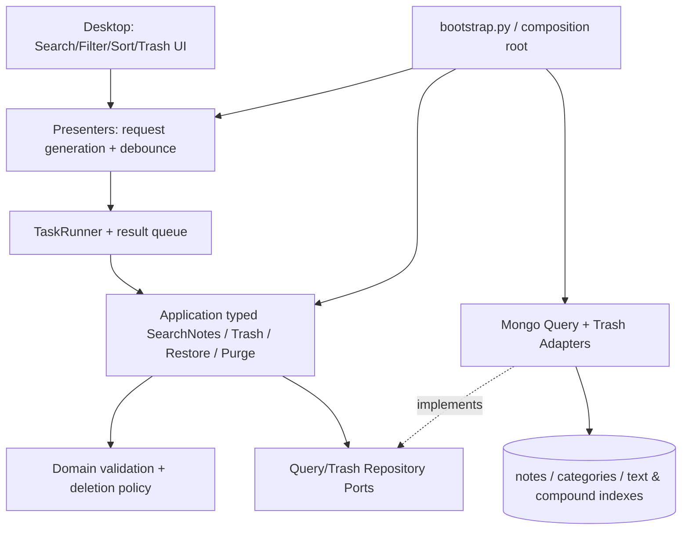

# PHASE 2 — SEARCH, FILTER, SORT & TRASH / IMPLEMENTATION MASTER PLAN

> **Project:** NoteApp / Team 5; **Ngày:** 10/10/2026; **trạng thái:** PROPOSED FOR EXECUTION; **baseline:** develop `16b4897` (cập nhật khi checkout). **Roadmap:** W3 sau Foundation W1–W2, không thay thế W4 Image/GridFS hoặc W5 Reminder/Recovery.

## 1. Tuyên bố outcome và giới hạn

**Từ góc nhìn người dùng:** Mở ứng dụng local → gõ từ khóa → lọc theo ngày/danh mục/ưu tiên → chọn cách sắp xếp → mở/sửa ghi chú phù hợp → xóa mềm → xem trong Trash → khôi phục hoặc xóa vĩnh viễn sau khi xác nhận. Kết quả nhất quán với MongoDB thật sau đóng/mở lại app.

**Giữ nguyên baseline Phase 1:** create/update/list, title 1..250, Priority HIGH/MEDIUM/LOW + rank, categories seeded, `client_operation_id`, optimistic CAS `version`, pagination 30, timestamp aware UTC, `TaskRunner` bounded + `UIEventPump`, 3 pane 20/30/50, Mongo local container. Không đổi signature cũ một cách breaking nếu không có adapter tương thích/migration.

| SRS source | Mức gốc | Phạm vi W3 / Phase 2 | Không được overclaim |
|---|---|---|---|
| FR-06 Full-text search | Shall | Mongo native text index trên title + nội dung thực tế `content_plain`, search non-deleted, debounce ~300ms, guard stale response | Mongo `$text` **không đồng nghĩa** substring/accent-insensitive; cần kiểm chứng tiếng Việt |
| FR-07 Date filter | Shall | Local calendar date range, chuyển `[start_utc,end_exclusive_utc)`, kết hợp query text/category/priority | Không dùng naive UTC cùng ngày cho toàn bộ hệ điều hành |
| FR-11 Sorting | Shall | 4 modes gốc: priority HIGH→MEDIUM→LOW, category A–Z, updated newest, created asc/desc | Không sắp xếp tập 10k hoàn toàn ở client |
| FR-03 Delete | Shall | Move to Trash, permanent delete có confirmation, bảo vệ version/concurrent edit | Không tuyên bố an toàn ảnh nếu chưa thực hiện cleanup GridFS W4 |
| FR-13 Trash | Should | List trash, restore, manual purge; retention 30 ngày/purge maintenance theo quyết định đã phê duyệt | Không tự nâng Should thành Shall. Không bật TTL gây orphan ảnh |
| FR-04 (phần chưa đủ) | Shall | Category filtering dựa vào lookup hiện hữu; **category create/rename/delete UI** là gap được theo dõi cho MVP (scope change riêng nếu kéo vào W3) | Không coi FR-04 full Done chỉ vì seeded catalog |
| FR-05 | Shall | Chọn priority có sẵn; lọc/sort theo `priority_rank` | Không bỏ validation HIGH/MEDIUM/LOW |

**Ngoài W3 theo roadmap gốc:** FR-08 image/GridFS W4; FR-09/10 reminder, draft recovery W5; FR-12 pin (Should) R1; FR-14 khóa (Should) R1; FR-15/16 May R2; SQLite standalone offline chưa thuộc SRS/release W3. Không tự mở rộng sang SQLite/API/Cloud Sync.

## 2. Tình trạng thực tế trên develop 10/10

| Vùng | Đã có Phase 1 | Khoảng trống W3 |
|---|---|---|
| `domain` | `Note`, `Category`, `Priority`, `ValidationError/Conflict` | `delete_policy.py` scaffold; invariants state deletion |
| `application` | `CreateNote`, `UpdateNote`, `ListNotes`, typed port, DTO | `search_notes.py`, `trash.py`, `restore.py`, `purge.py` docstring-only; query/filter/sort/trash ports chưa tồn tại |
| `infrastructure/mongo` | CRUD + `is_deleted=False` initial, unique operation, recent index | `$text` chưa có, category/date/sort query chưa có; trash transitions/purge chưa có; `deleted_at` chưa viết |
| `presentation/tk` | Sidebar/List/Editor, async queue, error states | search bar/filters/sort/trash mode/actions/confirm chưa có |
| `tests` | unit/contract/Mongo/E2E, fake+Mongo shared repository contracts | search semantics, date/DST, sort pages, deletion race, restore, purge fault chưa có |
| GitHub | PR #2, PR #4 merged; previous CI success | Phase 2 phải có own PR/checks; không reuse CI cũ để claim W3 pass |

**Tương thích schema:** Tất cả note Phase 1 có `is_deleted:false` và `schema_version:1`, nhưng không có `deleted_at`. Không được xóa/sửa mất dữ liệu cũ; writer Phase 2 chỉ thêm trường theo migration được review. Current mapper dùng `content_plain` (không phải `content` như ví dụ trong SRS gốc).

## 3. Ranh giới kiến trúc / luồng chạy

- **Only UI main thread**: `root.after`, Tk widget reads/writes, dialogs. Debounce scheduled/canceled by main thread; worker only performs query/DB writes and queues immutable results.
- **Application**: DTO + use cases + ports; no Mongo-specific `$text`, BSON, GridFS, Tk widgets.
- **Infrastructure**: whitelist sort, mapper ObjectId, encode/decode opaque cursor with signature/version, indexes and CRUD/trash CAS.
- **State**: request generation invalidates older search/page responses; filter/sort changes reset cursor/list atomically. When delete/open editor dirty/pending save, confirm and protect version.

## 4. Deliverables W3 và phụ thuộc

**E1 — Search read-path** (T020, T023, T025, T027): approved matching semantics; typed DTO/port; text + filter/date + sort Mongo; bounded pagination; Vietnamese fixture tests.

**E2 — Desktop navigation** (T021): sidebar search/category/priority and list sort/date, 300ms debounce, empty/error/loading UI, keyboard Ctrl+F, stable editor selection, Tk safe event pump.

**E3 — Trash lifecycle** (T024, T026, T028): version-aware soft-delete/restore; trash list/pagination; confirmed permanent delete; maintenance/purge contract, retry/backup path; absence of hardcoded TTL on notes.

**E4 — Trash UI** (T022): active/trash view switch, delete/restore/purge actions; modal cancel does not touch DB; no unsaved text lost.

**E5 — QA/CI** (T027, T028): Mongo integration, unit+contract, fake parity, desktop E2E, negative/race/fault, EXPLAIN/perf baseline. Existing regression still green.

## 5. Thời gian / năng lực: không che giấu quá tải

Roadmap gốc định nghĩa **W3 = T020–T028 tổng 86 giờ** (M1=7h, M2=21h, M3=21h, M4=19h, M5=18h). Giả định Phase 1 trước đó dùng **5 người × 16h/tuần = 80 giờ/tuần**; quá tải **6 giờ tổng** và M2/M3 đặc biệt quá tải. Kế hoạch này **không thay số giờ của backlog gốc**.

**Chọn một lịch trước kickoff:**

- **Phương án A — giữ W3 đúng lịch**: nhóm xác nhận tối thiểu 86h cộng sức review, M1 hỗ trợ QA/architecture/acceptance, M2/M3/M4/M5 có thêm capacity thực tế hoặc chia nhỏ tasks qua người có năng lực; không giả định ai có >16h mặc định.
- **Phương án B — giữ capacity 80h**: duyệt CR/sprint rebaseline, tách một phần phụ thuộc thấp (ví dụ purge scheduler automation, không phải manual hard-delete/restore) thành carry-over có ID/rủi ro sang đầu W4; đánh dấu Phase 2 **còn hạng mục**, không đánh dấu full accepted nếu gate yêu cầu scheduler.
- **Phương án C — thêm thời gian W3**: kéo dài 2–3 ngày, có kế hoạch cụ thể tác động Image W4. Không im lặng xê dịch FR-08/09/10.

**Thứ tự ưu tiên buộc giữ:** `FR-06+FR-07+FR-11` + `FR-03` + `FR-13 basic trash/restore` + regression/CI. No compromise data integrity. Không lấy thời gian bù bằng cách bỏ tests.

## 6. Mốc triển khai W3 theo thứ tự phụ thuộc

| Mốc | Công việc | Gate | Có thể chạy song song |
|---|---|---|---|
| Day 1 | M1 freeze DEC-07 search semantics, delete policy link; M3/M4 freeze Query DTO/Port + Trash Port; M5 tạo test matrix/seed | Contract/fields/index definitions approved | M2 mock UI với FakeQuery; M4 tạo index spike local |
| Day 2 | M3 Search/Filter/Sort use cases; M4 `$text` index + query; M2 search bar, filter state | Search with real Mongo, no UI DB call | M3 delete policy; M5 fake tests |
| Day 3 | M4 integration search text/date/category/sort and cursor; M2 debounce/stale results | E2E search/filter, no duplicate page, main thread responsive | M3 trash use cases; M5 search negative |
| Day 4 | M4 Trash adapter + migration/retention; M2 trash view/confirmation; M3 version policy | Delete→trash→restore and CAS tests pass | M5 delete failure/race tests |
| Day 5 | All integrate PRs, M5 run Mongo/UI regression and CI, M1 UAT; benchmark seed, publish known gaps | All P2-AC gates relevant pass or blocked explicitly | CI run after each PR; merge via declared order |

Nếu Day 3 chưa xong Query Repo + stale response tests: *không* cho xóa hàng loạt/dọn tự động chạy; giữ manual operations tách biệt để tránh lây rủi ro.

## 7. Dữ liệu, chỉ mục, migration

- `notes` giữ `_id`, `title`, `content_plain`, `category_id`, `priority`, `priority_rank`, `created_at`, `updated_at`, `version`, `is_deleted`; thêm `deleted_at` **chỉ khi xóa**; restore đặt `is_deleted:false`, xóa/null `deleted_at`, `version += 1`.
- `categories.name_key` là nguồn chuẩn tên phân loại; sort category A–Z không dựa lexical `category_id`; nếu cần `$lookup`, đo cost/explain. Priority sort dùng `priority_rank` 3/2/1.
- Index text có tên rõ: ứng viên `{title:"text", content_plain:"text"}` (SRS gốc dùng `content`, nhưng code dùng `content_plain`). **Chọn tokenizer/language và Vietnamese behavior bằng spike/DEC-07**, đừng tự nhận accent-insensitive. Chỉ lập 1 text index phù hợp Mongo.
- Index cho active list/filter/sort và Trash `is_deleted, deleted_at, _id`; thứ tự field được chốt sau `explain()` thay vì tự thêm 10 index; không phá `idx_notes_recent` hoặc unique operation/index category Phase 1.
- Script migration/index `--dry-run`, kiểm tra duplicates, no destructive reset, test chạy hai lần; backup dev/staging trước nâng schema, có đường rollback ứng dụng không xóa dữ liệu. Dữ liệu note v1 không có deleted_at vẫn đọc/sửa/tìm được.
- Tuyệt đối **không TTL index** trên `deleted_at`. P2-12 vẫn thuộc W3: automatic retention 30 ngày cho note text-only đã xác minh, sau safety gate và tests. Chỉ note có ảnh/format chưa hỗ trợ phải chờ cleanup lifecycle W4; không dời toàn bộ retention W3 sang W4 hoặc claim AC14 từ manual purge.

## 8. Các mốc quyết định (không yêu cầu duyệt lại điều nhóm đã chốt)

Hồ sơ gốc trên repo còn chữ `OPEN` ở DEC-02 (delete), DEC-07 (search), DEC-09 (perf). Người dùng cho biết nhóm đã chốt phê duyệt. **PM chỉ liên kết bản duyệt thực tế/ghi vào board/ADR; không mở lại phê duyệt**, nhưng developer cần đọc đúng quyết định hiện hành trước viết query/migration. Nếu tài liệu duyệt chưa có thì dùng mô hình được đề xuất có nhãn `ASSUMPTION`, không biến giả định thành nghiệp vụ chính thức.

## 9. NFR và kiểm thử

- Target SRS gốc: search **<200ms với 10k notes**; đo p95 database query + end-to-end (đừng claim đạt nếu chưa đo). Startup <2s/5k, UI smooth 60FPS, RAM 150/300 MB là targets toàn sản phẩm, không chuyển thành Passed khi chưa benchmark.
- Negative bắt buộc: `$`/JSON-like search string; 1000-char abusive query theo ngưỡng chốt; ngày đảo, DST day boundary; cursor cũ sau sort change; null category; deleted excluded; update/save cạnh tranh delete; restore cạnh tranh purge; hard-delete canceled; DB offline; queued task trả sau window.destroy.
- Regression toàn Phase 1: CreateNote, UpdateNote, current list, idempotency retry, category unique, CAS, UI closed callback and no secret logging.
- RTM và checklist chi tiết trong `05_TEST_RTM_ACCEPTANCE.md`.

## 10. Exit gate Phase 2 (chỉ khẳng định dựa chứng cứ)

1. Mã nguồn/port interfaces không phá `AGENTS.md`; không Tk/PyMongo cross-layer.
2. FR-06: query title + content persisted với Mongo index, search Vietnamese semantics documented và AC tests.
3. FR-07: filter ngày local inclusive, combined category/priority/text, excludes deleted, negative date.
4. FR-11: bốn sort modes và tie-break `id`, đúng priority/category, paginate không lặp/bỏ trang vì sort client.
5. FR-03/13: soft-delete, list trash, restore, explicit confirm permanent delete; CAS protection và lỗi I/O không mất dữ liệu.
6. `create_indexes`/migration idempotent; no TTL/orphan risk; existing Phase 1 fixtures vẫn pass.
7. UI debounce, stale response rejection, empty/loading/error, unsaved editor dialog, no main thread DB I/O.
8. Unit + contract + Mongo integration + desktop E2E trên PR CI **all green** và no silently skipped required checks.
9. RTM task links, migration/rollback, reviewer cross-check, UAT demo đủ luồng, chưa có P0/P1 bug trong scope.
10. Các yêu cầu **ngoài W3** và giới hạn performance chưa đo được ghi thành Known limitations, không giả claim completed.

**Phê duyệt release MVP toàn bộ** chưa phải milestone W3: FR-08/09/10 còn ở W4/W5 theo backlog. Phase 2 nghiệm thu chỉ theo scope W3.
