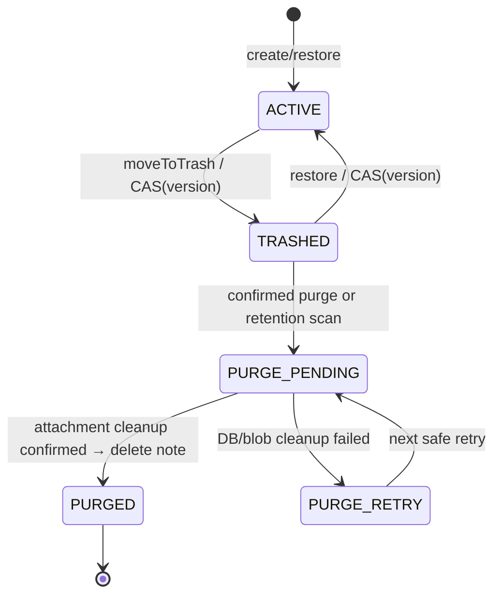

# PHASE 2 — TRASH / RESTORE / PURGE LIFECYCLE CONTRACT

**SRS mapping:** FR-03 (Shall), FR-13 (Should). **Source:** SRS gốc phần “Xóa ghi chú”, “Thùng rác và phục hồi”; Audit `AUD-01/AUD-02`, SRS v2 BR-07/08. **Existing backend:** `notes.is_deleted=False`, `notes.version`, `updated_at`, `schema_version=1`; `deleted_at` chưa có; `domain/policies/delete_policy.py`, commands trash/restore/purge còn scaffold.

## 1. Mục tiêu và semantics

- **Move to Trash**: thực hiện xóa tạm, ghi `is_deleted=True`, `deleted_at=now_utc`, `version += 1`; note không còn trong *mọi* active list/search/filter/sort; remains in Trash.
- **Restore**: trên đúng ID/version, `is_deleted=False`, `deleted_at` unset/null, `version += 1`; lại xuất hiện trong active list/search. Preserve title, text, priority, category, created_at and attachments.
- **Permanent Delete (manual)**: phải có modal `askyesno()` explicit yes; cancel = no DB write; after acceptance remove data and all linked images when attachments exist; never claim hard-delete complete if attachments remain.
- **30-day retention**: SRS gốc mô tả `TTL Index deleted_at`. Architecture review `AUD-02` xác định TTL BSON sẽ không tự xóa GridFS → orphan; **đề xuất purge worker/maintenance state instead**, giữ ý nghĩa kinh doanh 30 ngày, không áp dụng TTL unsafe. Nếu nhóm có baseline giữ TTL nguyên văn, phải ghi CR/approved deviation trước khi thay.
- **Safety:** no auto-purge while Phase2/Phase3 attachment cleanup adapter absent/unverified; script/worker must not destroy users' DB. Manual purge can be completed for Phase1 **text-only** notes using a bounded safe path; prepare interface for W4 attachments.

## 2. State machine đề xuất



`PURGE_PENDING`/`PURGE_RETRY` may be adapter maintenance metadata separate from domain Note and only activated when full attachment lifecycle is approved. **Do not add complex job queues if no attachments are in use**, but reserve a well-defined port and test stubs. Prior to W4, `PurgeNote` should not assume future GridFS files can be ignored.

| Current | Action | Result | Expected |
|---|---|---|---|
| ACTIVE | Trash with correct version | TRASHED | increment version; deleted_at UTC |
| ACTIVE | Trash with stale version | unchanged | Conflict; editor text preserved |
| TRASHED | Trash again | unchanged | Idempotent already-deleted or typed Conflict (contract freeze) |
| TRASHED | Restore with correct version | ACTIVE | original ID, content, category preserved; version increment |
| TRASHED | Restore stale version | unchanged | Conflict |
| ACTIVE | Restore | unchanged | typed invalid state/NotFound (contract freeze) |
| TRASHED | Purge when user cancels modal | TRASHED | **zero** repo calls |
| TRASHED | Purge confirmed & no attachment | PURGED | Mongo row removed only after explicit confirmation |
| PURGE_PENDING | Failure cleanup | retryable | no false success, no orphan silently abandoned |
| PURGED | Restore / Get | not found | no resurrection after permanent purge |

## 3. Contracts (illustrative)

```python
@dataclass(frozen=True)
class TrashCommand:
    note_id: str
    expected_version: int

@dataclass(frozen=True)
class TrashedNoteView:
    note: NoteView
    deleted_at: datetime

@dataclass(frozen=True)
class TrashPage:
    items: tuple[TrashedNoteView, ...]
    next_cursor: str | None

class TrashRepository(Protocol):
    def move_to_trash(self, note_id: str, expected_version: int, now: datetime) -> TrashedNoteView: ...
    def restore(self, note_id: str, expected_version: int) -> Note: ...
    def list_trashed(self, limit: int, cursor: str | None) -> TrashPage: ...
    def purge_confirmed(self, note_id: str, expected_version: int) -> None: ...
```

**Recommend** a separate `TrashRepository` port rather than modifying every Phase1 method: existing `NoteRepository.find_by_id()` intentionally excludes deleted notes, and `Note` dataclass does not contain `deleted_at` yet. Core may introduce a small `TrashedNote` DTO to preserve metadata without breaking old `NoteView`. The exact method signature and error types are to be frozen in P2-02.

### Concurrency safety

- Every destructive state change uses `{_id,version,is_deleted:expected}` in one atomic update; `$inc` version.
- Two clients editing/deleting same version: only one accepted; 0 matched → `NotFound` vs `Conflict` after safe existence check, matching Phase1 CAS semantics.
- If permanently purging a note, add a claim/tombstone to guard simultaneous restore and cleanup. Do not run an unsafe sequence `GridFS.delete()` then unconditionally `delete_one()` without recovery state.
- Use DB acknowledgements for UI SAVED/deleted states, never optimistic success before persistence.
- `updated_at` semantics for moving to Trash: document in decision (preserve note edit time or record deletion as update); **deleted_at** is the canonical Trash sort field either way.

## 4. Data schema and indexes

Current Phase1 example:

```javascript
{
  _id: ObjectId('...'), title:'...', content_plain:'...',
  priority:'MEDIUM', priority_rank:2,
  is_deleted:false, version:1,
  created_at:ISODate('...'), updated_at:ISODate('...'),
  schema_version:1
  // deleted_at absent
}
```

Proposed soft-deleted representation:

```javascript
{
  // same note fields above
  is_deleted:true,
  deleted_at:ISODate('...'),
  version:2
  // schema_version bump only with controlled migration rules
}
```

- Trash list query `is_deleted:true`, sort `deleted_at DESC, _id DESC`, keyset cursor; index candidate `{is_deleted:1,deleted_at:-1,_id:-1}`.
- Search and all active list default `is_deleted:false`; **never** include trash via broad unscoped `$text`.
- Version 1 notes lack `deleted_at`; treat as active if `is_deleted:false`, no eager whole-DB rewriting without tested migration; schema version new field strategy documented in `migrations.py`.
- **Don't add TTL on notes.deleted_at**. If any TTL exists from earlier experiments, audit before deployment; do not drop automatically in code without backup/change request.

## 5. Retention 30 ngày / attachments W4 hand-off

Data safety requirement: when a note has an image attachment, **delete the attachment and note together logically**, even when Mongo/GridFS lacks a cross-service transaction accessible to desktop. For W3 provide an abstraction `AttachmentCleanupPort` (or approved equivalent); W4 implements real inline and GridFS behavior.

Proposed idempotent maintenance algorithm (not automatically enabled W3):

1. Query bounded candidate trash notes older than 30 days with no active claim.
2. Atomically mark claim/state `PURGE_PENDING` for note version.
3. Read attachment references; delete verified referenced blobs if present, store cleanup status (retry if fail).
4. Once cleanup acknowledged, delete note with version/state predicate; record sanitized outcome.
5. On crash, recovery scan resumes idempotently, no timeout TTL bypasses cleanup.
6. Manual purge uses the same safe cleanup workflow with explicit UI confirmation; not a separate unsafe fast path.

**Ambiguity to resolve only by linking existing approved decisions:** whether 30-day count starts `deleted_at`, whether category delete impacts trash; whether restore with expired deletion is allowed if automated purge hasn't executed. Do not invent semantics in production.

## 6. UI behavior / required interactions

- Sidebar: `Tất cả ghi chú`, `Thùng rác`; search/filter controls apply only active collection unless trash search explicitly designed separately.
- Active list: Delete button or keyboard Delete with focus guard; if editor dirty, confirm unsaved changes; after delete show clear status/undo link.
- Trash list: timestamp `deleted_at`, Restore, Permanently Delete. Permanent button opens `messagebox.askyesno` on main Tk thread; warning communicates irreversibility.
- On failed network/update: keep current editor text and row until DB ACK; error code UI mapped safely; no raw Mongo errors or secret fields logged.
- Switching modes invalidates outstanding active search result; cannot show stale active result in Trash; vice versa.
- Exit/window close while cleanup runs: safe executor shutdown and no late destroyed-widget callback; no claim operation rolled back after DB may have committed.

## 7. Negative and data integrity cases

| ID | Case | Expected |
|---|---|---|
| TR-01 | Two delete requests same old version | one success; stale rejected (or idempotent per contract), never two state transitions |
| TR-02 | Save races delete | one CAS winner; no ghost active row |
| TR-03 | Restore from trash, then search | returned in active list/search; same note ID |
| TR-04 | Canceled hard-delete dialog | unchanged row + no DB purge call |
| TR-05 | DB disconnected during delete | UI still editable, no false removed state |
| TR-06 | Purge fault after attachment removal | job retryable/reconciled, no untracked orphan |
| TR-07 | Create note from Phase1 no deleted_at | query/search still works; cannot be mistaken for Trash |
| TR-08 | Trash record 29d23h vs 30d | cutoff safe; no purge before threshold |
| TR-09 | Permanently deleted note | no return from active search, trash list or restore |
| TR-10 | Tried restore using stale version | typed Conflict, user content preserved |

## 8. Delivery gates / rollback

- Merge core policy + adapter + UI only with real tests; hard-delete implementation is **blocked** if real GridFS references can exist and no cleanup adapter confirmed.
- Index setup idempotent, migration documented `--dry-run`; snapshot/backup before destructive schema edits; no `down -v`, `drop_database` except fixture-generated test DB.
- Rollback code should not silently reset `is_deleted`; preserve tombstones and versions. Schema fields additive so old Phase1 code may not display trashed notes but must not unintentionally restore them.
- Before W4 FR-08, re-review purge hook with actual `image_binary/image_gridfs_id` behavior, cleanup retry tests and orphan reconciler.
