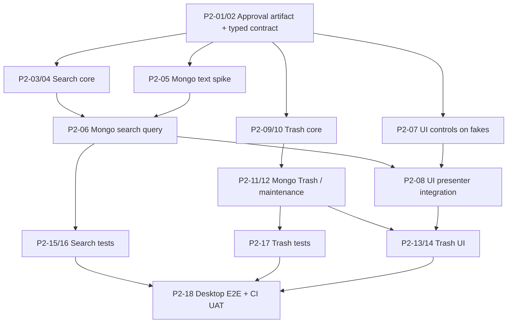

# PHASE 2 — PARALLEL WORKSTREAMS / BRANCHES / MERGE PLAYBOOK

**Team:** M1 PM/Architecture; M2 Desktop UI; M3 Domain/Application; M4 Mongo/Data; M5 QA. **Target branch:** `develop`; `main` remains release-only. **Scope:** W3 tasks P2-01..18 (maps T020..T028). **No remote changes performed by this planning package.**

## 1. Why this split is necessary

Current Phase1 code has shared editing hotspots: `src/noteapp/bootstrap.py`, `presentation/tk/views/app_window.py`, `presentation/tk/presenters/notes_presenter.py`, `infrastructure/mongo/repositories.py`, `infrastructure/mongo/indexes.py`. Letting M2/M3/M4 simultaneously edit all shared files causes conflicts, breaking DTOs and poor test reliability. Use **contract first**, then module owners, then one integration PR per junction.

## 2. Feature branches and output gates

| Merge step | Suggested branch | Owner / reviewer | Allowed scope | Merge gate |
|---|---|---|---|---|
| 0 | `docs/p2-contract-freeze` | M1 / M3+M4 | ADR/criteria/ports signatures docs, no runtime | Decisions linked; ownership agreed |
| 1 | `feature/p2-search-core` | M3 / M1+M5 | `application/dto`, `queries/search_notes.py`, `ports/query_*`, pure validation | Fake/contract unit green |
| 2 | `feature/p2-mongo-query` | M4 / M3+M5 | Mongo search query/index, additive migration/scripts | Real text/filter/sort/limit tests green; index idempotent |
| 3 | `feature/p2-search-ui` | M2 / M1+M5 | search widgets, presenter and state, minor composition root | Debounce/late response/UI smoke green |
| 4 | `feature/p2-trash-core` | M3 / M1+M4 | `delete_policy`, trash/restore/purge use cases, trash port/DTO | state/CAS fake tests green |
| 5 | `feature/p2-mongo-trash` | M4 / M3+M5 | Mongo trash adapter, index/migration/maintenance state | real Mongo delete/restore/purge tests green |
| 6 | `feature/p2-trash-ui` | M2 / M1+M5 | trash views/dialogs, presenter wiring | active/trash E2E + modal cancel test green |
| 7 | `test/p2-regression` | M5 / M1+M3 | RTM/evidence, shared contract tests, CI suites | Full suite+CI E2E+documented bench/limits |

**Branch source:** cut each from latest `develop` when predecessors merge; don't create 8 branches at once from old SHA. For faster concurrency, M2/M3/M4 implement behind typed fakes during earlier PRs, then rebase their feature branch before opening PR. No force-push other people's branches; no changes on main.

## 3. Ownership matrix / shared-file locks

| Hot file | Primary owner | Request changes through |
|---|---|---|
| `application/dto/note_filter.py` | M3 | S1 PR + contract review |
| `application/ports/*` | M3 | P2-02 freeze first |
| `infrastructure/mongo/repositories.py` | M4 | One Mongo PR sequence S2 then T2 |
| `infrastructure/mongo/indexes.py` | M4 | S2 migration; T2 follow-up, never concurrent PR |
| `presentation/tk/presenters/notes_presenter.py` | M2 | Search UI PR then trash UI PR |
| `presentation/tk/views/app_window.py` | M2 | Search UI PR then trash UI PR |
| `bootstrap.py` | M1 + M2/M4 coordination | Last integration commit in each PR after adapters ready |
| `tests/repository_contracts.py` | M5 | Expand only after interface freeze, run fake+Mongo |
| `docs/testing/PHASE2_TEST_REPORT.md` | M5 | Evidence from actual tests, no invented results |

## 4. Ready and Done checklist per PR

**DoR:** task ID + original backlog ID + FR/AC, exact files, dependent commits, input DTO contract, reviewer, risk, tests and mock fixtures. Unresolved core decision is a blocker only for the affected feature; do not rewrite unrelated approved decisions.

**DoD:** source code that executes (not docstring scaffold), pure core tests, Mongo test where applicable, no disabled tests, lint/format, intentional negative test, CI for HEAD, screenshots for UI, indices/backward compatibility, rollback, no content/secrets logged, reviewer independent.

### Copy-ready PR body

```markdown
## Scope
- Task: P2-XX / backlog: T0XX / FR: FR-...
- Base: develop @ ...; dependency PRs: ...
- What changes / explicitly deferred: ...

## Architecture + data
- Use case → Port → Adapter mapping:
- Index/migration: fields, backward compatibility, dry-run, rollback:
- Concurrency: expected_version, cursor fingerprint, async lifecycle:

## Tests (real output, no guesses)
- `ruff check .` / format: ...
- `pytest tests/unit tests/contract`: ...
- `pytest tests/integration`: ...
- `pytest tests/ui` + Windows/Xvfb: ...
- DB fixture cleanup safe: yes/no
- CI run link and commit SHA: ...

## Risk / reviewer
- Cases intentionally not supported: ...
- Reviewer other than author: ...
- Demo screenshot/video or logs: ...
```

## 5. Parallel sprint calendar / dependency gates



**Day1:** freeze source of truth and skeleton ports; M5 author failing contract tests; M4 text index spike; M2 layout controls using fakes.

**Day2:** M3 core query; M4 adapters; M2 search controls; M5 Vietnamese seed. Make PR S1 before S2 full query.

**Day3:** merge S2 after real Mongo checks; M2 connect search and stale guard; M3 trash core; M5 race tests.

**Day4:** M4 Mongo trash+index; M2 UI trash; QA integration and regression. Freeze destructive purge until safe.

**Day5:** M5 full suite, CI required checks, M1 human acceptance/review. **If unfinished:** explicit blocker and carry-over on W4 instead of merging unsafe deletion code.

## 6. Practical setup and commands

Start from source controlled baseline (PowerShell):

```powershell
git fetch origin
git switch develop
git pull --ff-only origin develop

git switch -c docs/p2-contract-freeze
# ... commit docs and open PR ...

git switch develop
git pull --ff-only origin develop
git switch -c feature/p2-search-core
# ... after contract PR merged ...
```

For local app, follow root `README.md` and `.env.example`. To run Python tests with Mongo:

```powershell
docker compose -f compose.dev.yml up -d --wait
$env:NOTEAPP_TEST_MONGO_URI="mongodb://127.0.0.1:27017"
$env:NOTEAPP_REQUIRE_MONGO="1"
.\.venv\Scripts\python.exe -m pytest -q tests/unit tests/contract tests/integration
```

To run actual Tk desktop scenarios, `NOTEAPP_REQUIRE_UI=1` with display present; use current CI jobs for Linux Xvfb and Windows. **Do not** add fake local `.env` or development DB data to git.

## 7. Merge/UAT/rollback

- `develop` receives each reviewed PR only if checks green; update dependent branch from develop before next merge. Release to `main` **not** part of Phase2 W3.
- At Phase2 checkpoint M1 executes the full UAT script in `05_TEST_RTM_ACCEPTANCE.md`, links GitHub Actions, screenshot, and performance baseline; no self-attested acceptance.
- If rollback: revert PRs in reverse dependency order, not force-reset shared develop. Never drop DB or Docker volumes to “rollback”. Additive indexed fields may remain and be cleaned by separately approved migration only.
- **W4 attachment integration handoff** must receive Trash/Purge cleanup hook and retention policy, because original SRS expects permanent delete of GridFS fragments.
