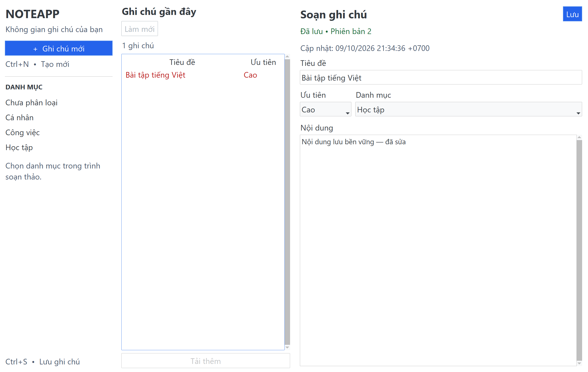

# Phase 1 implementation evidence

Branch: `feature/foundation`. Baseline: `d92292e`. Date: 2026-10-09.
Scope: P1 technical foundation and text create/list/edit; FR-01/02/04/05,
CST-01/02/03, reliability and architecture tests. Source plan:
[`PHASE1_FOUNDATION_CRUD.md`](../srs/phase%201/PHASE1_FOUNDATION_CRUD.md).

## Commit slices and dependencies

| Slice | Tasks / owner | Dependency | Planned checks |
| --- | --- | --- | --- |
| Contracts and assumptions | P1-01/02, M1/M3/M4 | Supplied rules/plan | Proposed ADR, no false sign-off |
| Tooling / CI / dev setup | P1-03/04/07, M5/M4 | Existing scaffold | Editable install, Ruff, isolated Mongo readiness |
| Domain / ports / use cases | P1-05/06/11/12/14, M3 | Proposed ADR | Unit boundaries, fake ports, architecture negative samples |
| Mongo persistence / scripts | P1-08/13/16, M4 | Core contracts, dev setup | Real Mongo mapping, CAS, idempotency, pagination, category uniqueness |
| Tk shell / async / CRUD | P1-09/10/15/17, M2 | Core and Mongo adapters | Presenter state, worker queue, stale callbacks, GUI smoke |
| Integration evidence | P1-18/19/20, M5/M1 | All implementation slices | Full checks, Windows smoke, open acceptance gates |

Task board linked by the plan is absent. IDs not explicitly mapped by the plan
are provisional mappings for review. New files are limited to tooling/dev setup,
tests/fakes (M5), and ADR/evidence (M1). Existing scaffold modules are reused.

## Open governance / acceptance gates

- Original approved SRS and `PHASE1_TASK_BOARD.md` are not present in this checkout.
- DEC-01/04/08/09 and ADR acceptance remain pending; no production migration,
  public database, content cap, release, push or merge is performed.
- Independent review, signed M1/M5 UAT, GitHub Actions run URLs and deliberate
  failed-PR evidence must be provided by the team. Local tests cannot establish them.
- Deferred scaffold modules remain scaffold, not completed features. No local
  plaintext draft persistence or misleading `LOCAL_DRAFT` state is implemented.

## Actual local validation

Windows, Python **3.11.9**, fresh `.venv`; PyMongo **4.18.3**,
ttkbootstrap **1.20.4**, pytest **8.4.2**, Ruff **0.16.10**.
Mongo **7.0** runs in `noteapp-dev-mongo-1`, bound to **127.0.0.1:27017**.
Docker Desktop was started locally. The dedicated dev container/volume and venv
remain available for development. Test fixtures only clean up their generated DBs.

| Command (venv Python) | Observed result |
| --- | --- |
| `python -m pip install -e ".[dev]"` | Successful editable install in the new venv |
| `docker compose -f compose.dev.yml up -d --wait` | Dedicated Mongo container healthy |
| `python -m ruff check .` | All checks passed |
| `python -m ruff format --check .` | 105 Python files already formatted |
| `python -m compileall -q src scripts` | Exit 0 |
| `actionlint -shellcheck='' .github/workflows/ci.yml` | actionlint 1.7.12 exit 0; shellcheck disabled on this Windows host |
| `python -m pytest -q --cov=noteapp.domain --cov=noteapp.application --cov-report=term-missing` | **97 passed**, 23.21s; **97%** core statement coverage (276 statements, 9 missed) |
| Final `python -m pytest -q` after public callback/adapter annotations | **97 passed**, 20.88s; no skipped tests |
| `git diff --check` | Exit 0 |

The full test runs exported `NOTEAPP_TEST_MONGO_URI` for the loopback container,
`NOTEAPP_REQUIRE_MONGO=1`, and `NOTEAPP_REQUIRE_UI=1`. The screenshot run also used
`NOTEAPP_CAPTURE_UI=1`. Optional capture uses Pillow 12.3's Windows HWND capture
and captures only this app's synthetic test window.

## Local evidence mapped to acceptance criteria

| AC | Evidence available on this branch | Acceptance limitation |
| --- | --- | --- |
| AC01 | Editable install; README setup commands | No independent clean-clone UAT yet |
| AC02 | `tests/contract/test_architecture.py`: layer gates, stdlib-only core, absolute/relative/aliased negative imports | ADR still Proposed |
| AC03 | `tests/unit/test_core.py`: blank, 1/250/251 title, priority, UTC, invalid input | Original signed SRS not provided |
| AC04 | Real Mongo read-back, category/priority and Vietnamese text; desktop scenarios | Technical isolated DB only |
| AC05 | Create and edit scenarios run in **separate Python processes**, with new Tk root and Mongo client; persisted note survives restart | Automated Windows evidence, not signed manual UAT |
| AC06 | Real update ACK, version increment, aware UTC; local-time editor metadata | No production migration |
| AC07 | Concurrent CAS allows one winner; stale desktop save preserves editor text | Human review pending |
| AC08 | Eight concurrent create retries produce one Mongo row; lost-ACK then edited retry keeps new editor content | No multi-device sync claim |
| AC09 | Unique normalized `Study` / ` study ` rejection; default-category script run twice | Category lifecycle UI deferred |
| AC10 | Presenter states plus actual Tk validation/conflict/unavailable scenarios preserve content | Unsaved text remains in RAM only |
| AC11 | 500ms worker does not block owner events; bounded submissions, stale callback rejection, close while pending, three-pane ratio assertions | No FPS/startup/RAM benchmark claim |
| AC12 | Real quality/integration/Windows UI jobs; pinned Actions commits; actionlint validation | **OPEN: no remote Actions run URL or deliberate failed-PR evidence** |
| AC13 | Config validates isolated loopback targets; URI excluded from repr; formatter emits correlation/stage/duration/error only; sanitized launcher tests | Remote auth/TLS policy remains DEC-04 OPEN |
| AC14 | Proposed ADR, rules, test evidence and rollback records | **OPEN: M1/M2/M3/M4 contract approval, independent review, signed M1/M5 UAT** |

The screenshot is implementation evidence, not an independent acceptance signature.
Core coverage does not establish behavior of deferred scaffold modules (they have
zero executable statements). CI provisions Mongo and fails when it is unavailable;
headless Linux excludes desktop scenarios explicitly. Windows UI smoke requires a
working display and fails rather than silently skipping when CI sets REQUIRE_UI.

## Changed file ownership

- M1: `docs/adr/0001-phase1-core-boundaries.md`, this evidence document,
  `bootstrap.py`, `main.py`; supplied rules/plan/template committed as provided.
- M3: Note/Category/Priority, validation/errors; application Create/Update/Get/List,
  DTOs and NoteRepository/CategoryRepository/Clock ports in the existing scaffold.
- M4: config; Mongo client/models/indexes/repositories; telemetry logging;
  `compose.dev.yml`, `scripts/create_indexes.py`, `scripts/seed_notes.py`.
- M2: existing Tk views/presenters/states/async bridge modules, including DPI-aware
  sizing, uniform three-column 20/30/50 layout, safe save state and UTC-to-local metadata.
- M5: pyproject/dev extras, `.env.example`, README, actual CI; architecture/unit/
  Mongo/UI tests; shared `tests/fakes.py` and `tests/desktop_scenarios.py` harness.

The QA harness is outside the diagram because it owns fresh-process GUI scenarios,
not runtime business behavior. Release workflow and Phase 2 scaffold behavior remain
unchanged. No API, plaintext draft persistence, TTL, destructive migration, new content
cap, release, push, or merge was performed.

## Reviewable commits

| Commit | Slice |
| --- | --- |
| `ed36902` | Rules/plan and Proposed ADR assumptions |
| `5da1bd3` | Dependencies, isolated dev setup, initial import gate |
| `b12ceb3` | Domain, typed DTO/ports and core use cases |
| `4023ed7` | Correct UTF-8 Vietnamese examples/tests |
| `ad088a1` | Mongo mapping, CAS, idempotency, indexes, seeds and isolated integration |
| `63b3ea1` | Tk shell, bounded workers, presenters and state tests |
| `80ab1ef` | DPI/three-pane layout, safe root cleanup, local-time metadata |
| `ad5307a` | Sanitized operation telemetry and launcher errors |
| `a4f4623` | CI quality/Mongo/Windows UI and stronger architecture gate |
| `0dd9da1` | Fresh-process desktop persistence/conflict/outage and repeatable script tests |

## Rollback and next human gates

Revert implementation commits in reverse dependency order on a new branch using
`git revert <commit>`, then run the documented checks. Preserve all development
data; no rollback command deletes or drops a database. `docker compose -f
compose.dev.yml stop` stops the local service while keeping its volume. No `down -v`
or schema rollback/migration is part of this change.

**Phase 1 remains NOT ACCEPTED pending the open human/remote gates above.** The team
must review the Proposed ADR, resolve DEC blockers, review the branch independently,
run Actions after an authorized push/PR, provide deliberate-failure evidence, and sign
UAT. This branch completes the reviewable technical slice, not those approvals.
